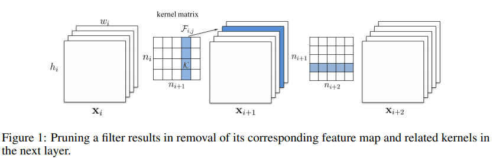
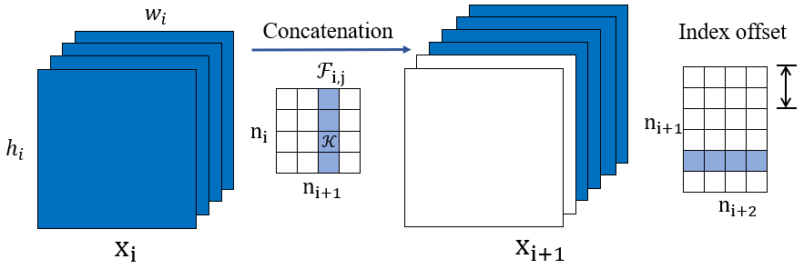

# Torch-Pruning

A pytorch toolkit for structed neural network pruning and layer dependency maintaining.

Torch-Pruning is dedicated to automatically detect and maintain the layer dependencies for structured pruning and provide reusable implementations. You can pay more attention to the design of pruning algorithms with the help of the dependency management.

This toolkit has the following features:

* Basic pruning functions for Convolution Neural Networks
* Layer dependency management
* Dependency customization for complex modules

## Layer Dependency

### A Simple Dependency



### Complicated Cases

the layer dependency becomes much more complicated when the model contains skip connections or concatenations (Denseblock). 

#### Residual Block: 


#### Concatenation: 


See paper [Pruning Filters for Efficient ConvNets](https://arxiv.org/abs/1608.08710) for more detials.

## How It Works

Torch-Pruning provide a `DependencyGraph` class to manage the dependencies between layers. 
It requires a fake input to run the model and collect layer infomation from the dynamic computational graph.
During pruning, `DependencyGraph.get_pruning_plan` detects the affected layers for the specified user operation and return a `PruningPlan`.


## Quickstart

### prune with DependencyGraph 

```python
import torch
from torchvision.models import resnet18
import torch_pruning as pruning
model = resnet18(pretrained=True)
# build layer dependency for resnet18
DG = pruning.DependencyGraph( model, fake_input=torch.randn(1,3,224,224) )
# get a pruning plan according to the dependency graph. idxs is the index of pruned filters.
pruning_plan = DG.get_pruning_plan( model.conv1, pruning.prune_conv, idxs=[2, 6, 9] )
print(pruning_plan)
# execute this plan (prune the model)
pruning_plan.exec()
```

Pruning the resnet.conv1 will affect several modules. The pruning plan:

```
[ prune_conv on conv1 (Conv2d(3, 64, kernel_size=(7, 7), stride=(2, 2), padding=(3, 3), bias=False)), Indexs=[2, 6, 9], NumPruned=441]
[ prune_batchnorm on bn1 (BatchNorm2d(64, eps=1e-05, momentum=0.1, affine=True, track_running_stats=True)), Indexs=[2, 6, 9], NumPruned=6]
[ _prune_elementwise_op on elementwise (_ElementWiseOp()), Indexs=[2, 6, 9], NumPruned=0]
[ _prune_elementwise_op on elementwise (_ElementWiseOp()), Indexs=[2, 6, 9], NumPruned=0]
[ prune_related_conv on layer2.0.conv1 (Conv2d(64, 128, kernel_size=(3, 3), stride=(2, 2), padding=(1, 1), bias=False)), Indexs=[2, 6, 9], NumPru
ned=3456]
[ prune_batchnorm on layer1.1.bn2 (BatchNorm2d(64, eps=1e-05, momentum=0.1, affine=True, track_running_stats=True)), Indexs=[2, 6, 9], NumPruned=6]
[ prune_conv on layer1.1.conv2 (Conv2d(64, 64, kernel_size=(3, 3), stride=(1, 1), padding=(1, 1), bias=False)), Indexs=[2, 6, 9], NumPruned=1728]
[ prune_related_conv on layer2.0.downsample.0 (Conv2d(64, 128, kernel_size=(1, 1), stride=(2, 2), bias=False)), Indexs=[2, 6, 9], NumPruned=384]
[ prune_related_conv on layer1.1.conv1 (Conv2d(64, 64, kernel_size=(3, 3), stride=(1, 1), padding=(1, 1), bias=False)), Indexs=[2, 6, 9], NumPruned=1728]
[ prune_batchnorm on layer1.0.bn2 (BatchNorm2d(64, eps=1e-05, momentum=0.1, affine=True, track_running_stats=True)), Indexs=[2, 6, 9], NumPruned=6]
[ prune_conv on layer1.0.conv2 (Conv2d(64, 64, kernel_size=(3, 3), stride=(1, 1), padding=(1, 1), bias=False)), Indexs=[2, 6, 9], NumPruned=1728]
[ prune_related_conv on layer1.0.conv1 (Conv2d(64, 64, kernel_size=(3, 3), stride=(1, 1), padding=(1, 1), bias=False)), Indexs=[2, 6, 9], NumPruned=1728]
11211 parameters will be pruned
-------------
```

### Prune with basic pruning functions

You must manually handle the dependencies between layers without DependencyGraph.

```python
pruning.prune_conv( model.conv1, idxs=[2,6,9] )
```

## Example: ResNet18 on Cifar10

### 1. Train the model
```bash
cd examples
python prune_resnet18.py --mode train # 11.1M, Acc=0.9281
```

### 2. Pruning and fintuning
```bash
python prune_resnet18.py --mode prune --round 1 --total_epochs 30 --step_size 20 # 4.5M, Acc=0.9228
python prune_resnet18.py --mode prune --round 2 --total_epochs 30 --step_size 20 # 1.9M, Acc=0.9237
python prune_resnet18.py --mode prune --round 3 --total_epochs 30 --step_size 20 # 0.8M, Acc=0.9199
python prune_resnet18.py --mode prune --round 4 --total_epochs 30 --step_size 20 # 0.4M, Acc=0.9125
python prune_resnet18.py --mode prune --round 5 --total_epochs 30 --step_size 20 # 0.2M, Acc=0.9040
python prune_resnet18.py --mode prune --round 6 --total_epochs 30 --step_size 20 # 0.1M, Acc=0.8905
...
```

# TODO

* Documents
* Predefined pruning algorithms
* Test the toolkit with Densenet / MobileNet / ...

