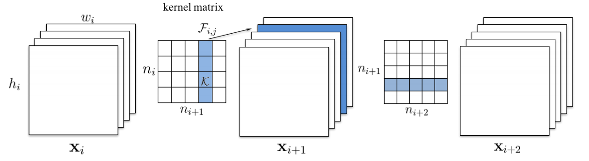
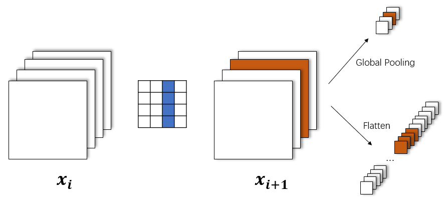
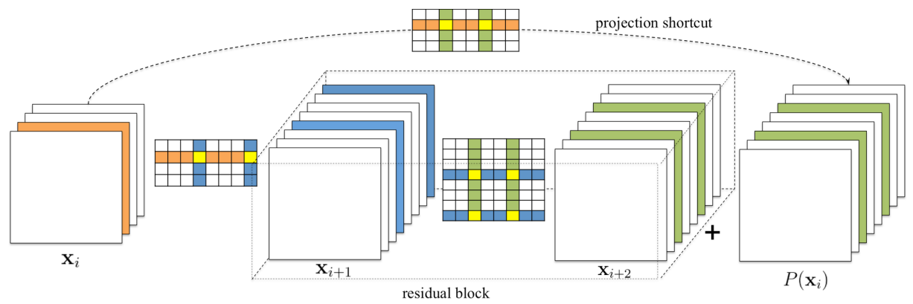
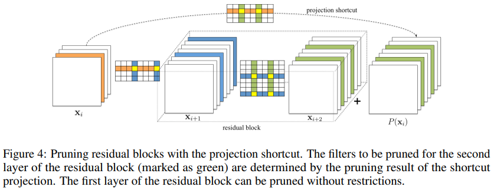

# Torch-Pruning

A pytorch toolkit for structured neural network pruning and layer dependency maintaining

This tool will automatically detect and handle layer dependencies (channel consistency) during pruning. It is able to handle various network architectures such as DenseNet, ResNet, and Inception. See [examples/test_models.py](https://github.com/VainF/Torch-Pruning/blob/master/examples/test_models.py) for more supported models. 

## How it works

This package will run your model with fake inputs and collect forward information just like ``torch.jit``. Then a dependency graph is established to describe the computational graph. When a pruning function (e.g. torch_pruning.prune_conv ) is applied on certain layer through ``DependencyGraph.get_pruning_plan``, this package will traverse the whole graph to fix inconsistent modules such as BN. The pruning index will be automatically mapped to correct position if there is ``torch.split`` or ``torch.cat`` in your model.


Tip: please remember to save the whole model object (weights+architecture) rather than only model weights:

```python
# save a pruned model
# torch.save(model.state_dict(), 'model.pth') # weights only
torch.save(model, 'model.pth') # obj (arch) + weights

# load a pruned model
model = torch.load('model.pth') # no load_state_dict
```

|  Dependency           |  Visualization  |  Example   |
| :------------------:  | :------------:  | :-----:    |
|    Conv-Conv          |   | AlexNet  |
|    Conv-FC (Global Pooling or Flatten) |     | ResNet, VGG    |  
|    Skip Connection    |    | ResNet
|    Concatenation      |      | DenseNet, ASPP |
|    Split              |       | torch.chunk |

**Known Issues**: 

* Only depthwise conv is supported when groups>1, i.e. `groups`=`in_channels`=`out_channels`. 
* Customized operations will be treated as element-wise op, e.g. subclass of `torch.autograd.Function`. 

## Installation

```bash
pip install torch_pruning
```


## Quickstart

### A minimal example 

```python
import torch
from torchvision.models import resnet18
import torch_pruning as tp

model = resnet18(pretrained=True)

# 1. setup strategy (L1 Norm)
strategy = tp.strategy.L1Strategy() # or tp.strategy.RandomStrategy()

# 2. build layer dependency for resnet18
DG = tp.DependencyGraph()
DG.build_dependency(model, example_inputs=torch.randn(1,3,224,224))

# 3. get a pruning plan from the dependency graph.
pruning_idxs = strategy(model.conv1.weight, amount=0.4) # or manually selected pruning_idxs=[2, 6, 9]
pruning_plan = DG.get_pruning_plan( model.conv1, tp.prune_conv, idxs=pruning_idxs )
print(pruning_plan)

# 4. execute this plan (prune the model)
pruning_plan.exec()
```

Pruning the resnet.conv1 will affect several layers. Let's inspect the pruning plan (with pruning_idxs=[2, 6, 9]):

```
-------------
[ <DEP: prune_conv => prune_conv on conv1 (Conv2d(3, 64, kernel_size=(7, 7), stride=(2, 2), padding=(3, 3), bias=False))>, Index=[2, 6, 9], NumPruned=441]
[ <DEP: prune_conv => prune_batchnorm on bn1 (BatchNorm2d(64, eps=1e-05, momentum=0.1, affine=True, track_running_stats=True))>, Index=[2, 6, 9], NumPruned=6]
[ <DEP: prune_batchnorm => _prune_elementwise_op on _ElementWiseOp()>, Index=[2, 6, 9], NumPruned=0]
[ <DEP: _prune_elementwise_op => _prune_elementwise_op on _ElementWiseOp()>, Index=[2, 6, 9], NumPruned=0]
[ <DEP: _prune_elementwise_op => prune_related_conv on layer1.0.conv1 (Conv2d(64, 64, kernel_size=(3, 3), stride=(1, 1), padding=(1, 1), bias=False))>, Index=[2, 6, 9], NumPruned=1728]
[ <DEP: _prune_elementwise_op => _prune_elementwise_op on _ElementWiseOp()>, Index=[2, 6, 9], NumPruned=0]
[ <DEP: _prune_elementwise_op => prune_batchnorm on layer1.0.bn2 (BatchNorm2d(64, eps=1e-05, momentum=0.1, affine=True, track_running_stats=True))>, Index=[2, 6, 9], NumPruned=6]
[ <DEP: prune_batchnorm => prune_conv on layer1.0.conv2 (Conv2d(64, 64, kernel_size=(3, 3), stride=(1, 1), padding=(1, 1), bias=False))>, Index=[2, 6, 9], NumPruned=1728]
[ <DEP: _prune_elementwise_op => _prune_elementwise_op on _ElementWiseOp()>, Index=[2, 6, 9], NumPruned=0]
[ <DEP: _prune_elementwise_op => prune_related_conv on layer1.1.conv1 (Conv2d(64, 64, kernel_size=(3, 3), stride=(1, 1), padding=(1, 1), bias=False))>, Index=[2, 6, 9], NumPruned=1728]
[ <DEP: _prune_elementwise_op => _prune_elementwise_op on _ElementWiseOp()>, Index=[2, 6, 9], NumPruned=0]
[ <DEP: _prune_elementwise_op => prune_batchnorm on layer1.1.bn2 (BatchNorm2d(64, eps=1e-05, momentum=0.1, affine=True, track_running_stats=True))>, Index=[2, 6, 9], NumPruned=6]
[ <DEP: prune_batchnorm => prune_conv on layer1.1.conv2 (Conv2d(64, 64, kernel_size=(3, 3), stride=(1, 1), padding=(1, 1), bias=False))>, Index=[2, 6, 9], NumPruned=1728]
[ <DEP: _prune_elementwise_op => _prune_elementwise_op on _ElementWiseOp()>, Index=[2, 6, 9], NumPruned=0]
[ <DEP: _prune_elementwise_op => prune_related_conv on layer2.0.conv1 (Conv2d(64, 128, kernel_size=(3, 3), stride=(2, 2), padding=(1, 1), bias=False))>, Index=[2, 6, 9], NumPruned=3456]
[ <DEP: _prune_elementwise_op => prune_related_conv on layer2.0.downsample.0 (Conv2d(64, 128, kernel_size=(1, 1), stride=(2, 2), bias=False))>, Index=[2, 6, 9], NumPruned=384]
11211 parameters will be pruned
-------------
```

## Low-level pruning functions

We have to manually handle the broken dependencies without DependencyGraph.

```python
tp.prune_conv( model.conv1, idxs=[2,6,9] )

# fix the broken dependencies manually
tp.prune_batchnorm( model.bn1, idxs=[2,6,9] )
tp.prune_related_conv( model.layer2[0].conv1, idxs=[2,6,9] )
...
```

## Layer Dependency

During structured pruning, we need to maintain the channel consistency between different layers. 

### A Simple Case


### More Complicated Cases

the layer dependency becomes much more complicated when the model contains skip connections or concatenations. 

#### Residual Block: 


#### Concatenation: 


See paper [Pruning Filters for Efficient ConvNets](https://arxiv.org/abs/1608.08710) for more details.


## Example: ResNet18 on Cifar10

### 1. Train the model
```bash
cd examples
python prune_resnet18_cifar10.py --mode train # 11.1M, Acc=0.9248
```

### 2. Pruning and fintuning
```bash
python prune_resnet18_cifar10.py --mode prune --round 1 --total_epochs 30 --step_size 20 # 4.5M, Acc=0.9229
python prune_resnet18_cifar10.py --mode prune --round 2 --total_epochs 30 --step_size 20 # 1.9M, Acc=0.9207
python prune_resnet18_cifar10.py --mode prune --round 3 --total_epochs 30 --step_size 20 # 0.8M, Acc=0.9176
python prune_resnet18_cifar10.py --mode prune --round 4 --total_epochs 30 --step_size 20 # 0.4M, Acc=0.9102
python prune_resnet18_cifar10.py --mode prune --round 5 --total_epochs 30 --step_size 20 # 0.2M, Acc=0.9011
...
```
