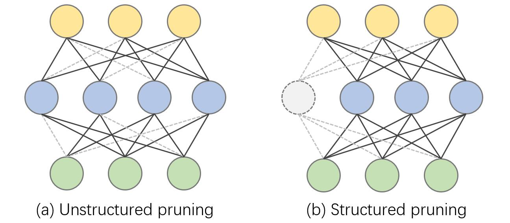
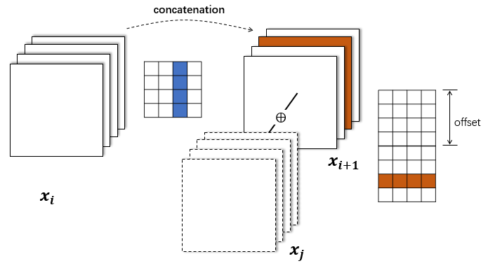
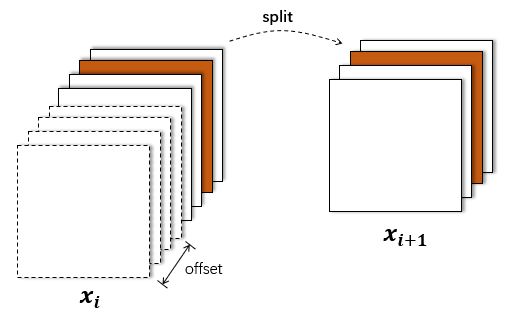

<div align="center"> <h1>Torch-Pruning <br> <h3>Structural Pruning for Model Acceleration<h3> </h1> </div>
<div align="center">

</div>

Torch-Pruning is a general-purpose library for structural network pruning, which supports a large variaty of nerual networks like Vision Transformers, ResNet, DenseNet, RegNet, ResNext, FCN, DeepLab, VGG, etc. Please refer to [tests/test_torchvision_models.py](tests/test_torchvision_models.py) for more details about prunable models.

### **Features:**
* Channel pruning for [CNNs](tests/test_torchvision_models.py) (e.g. ResNet, DenseNet, Deeplab) and [Transformers](tests/test_torchvision_models.py) (e.g. ViT)
* High-level pruners: MagnitudePruner, BNScalePruner, GroupPruner, etc.
* Graph Tracing and dependency fixing.
* Supported modules: Conv, Linear, BatchNorm, LayerNorm, Transposed Conv, PReLU, Embedding, MultiheadAttention, nn.Parameters and [customized modules](tests/test_customized_layer.py).
* Supported operations: split, concatenation, skip connection, flatten, etc.
* Pruning strategies: Random, L1, L2, etc.
* Low-level pruning [functions](torch_pruning/prune/structured.py)
* [Benchmarks](benchmarks) and [tutorials](tutorials)

### **Plans:**
* More high-level pruners like FisherPruner, SoftPruner, GeometricPruner, etc.
* Support more Transformers like Vision Transformers (:heavy_check_mark:), Swin Transformers, PoolFormers.
* Pruning benchmarks for CIFAR and ImageNet.
* A paper about this repo (:heavy_check_mark:, will be released ASAP)

## How it works

Torch-Pruning will forward your model with a fake inputs and trace the computational graph just like ``torch.jit``. A dependency graph will be established to record the relation coupling between layers. Torch-pruning will collect all affected layers according by propogating your pruning operations through the whole graph, and then return a `PruningClique` for pruning. All pruning indices will be automatically transformed if there are operations like ``torch.split`` or ``torch.cat``. 
  
## Installation

```bash
git clone https://github.com/VainF/Torch-Pruning.git
```

## Quickstart
  
Here we provide a quick start for Torch-Pruning. More explained details can be found in [tutorals](./tutorials/)

### 0. Dependency

|  Dependency           |  Visualization  |  Example   |
| :------------------:  | :------------:  | :-----:    |
|    Conv-Conv          |   | AlexNet  |
|    Conv-FC (Global Pooling or Flatten) |     | ResNet, VGG    |  
|    Skip Connection    |    | ResNet
|    Concatenation      |      | DenseNet, ASPP |
|    Split              |       | torch.chunk |

### 1. A minimal example

```python
import torch
from torchvision.models import resnet18
import torch_pruning as tp

model = resnet18(pretrained=True).eval()

# 1. build dependency graph for resnet18
DG = tp.DependencyGraph()
DG.build_dependency(model, example_inputs=torch.randn(1,3,224,224))

# 2. Select channels for pruning, here we prune the channels indexed by [2, 6, 9].
pruning_idxs = [2, 6, 9]
pruning_group = DG.get_pruning_group( model.conv1, tp.prune_conv_out_channels, idxs=pruning_idxs )

# 3. prune all grouped layer that is coupled with model.conv1
if DG.check_pruning_group(pruning_group):
    pruning_group.exec()

# 4. save & load the pruned model 
torch.save(model, 'model.pth') # save the model object
model_loaded = torch.load('model.pth') # no load_state_dict
```

In this example, pruning resnet.conv1 will affect several layers. Let's inspect the pruning group (with pruning_idxs=[2, 6, 9]):

```
--------------------------------
          Pruning Group
--------------------------------
[0] [DEP] prune_out_channels on conv1 (Conv2d(3, 61, kernel_size=(7, 7), stride=(2, 2), padding=(3, 3), bias=False)) => prune_out_channels on conv1 (Conv2d(3, 61, kernel_size=(7, 7), stride=(2, 2), padding=(3, 3), bias=False)), #Pruned=3
[1] [DEP] prune_out_channels on conv1 (Conv2d(3, 61, kernel_size=(7, 7), stride=(2, 2), padding=(3, 3), bias=False)) => prune_out_channels on bn1 (BatchNorm2d(61, eps=1e-05, momentum=0.1, affine=True, track_running_stats=True)), #Pruned=3
[2] [DEP] prune_out_channels on bn1 (BatchNorm2d(61, eps=1e-05, momentum=0.1, affine=True, track_running_stats=True)) => prune_out_channels on _ElementWiseOp(ReluBackward0), #Pruned=3
[3] [DEP] prune_out_channels on _ElementWiseOp(ReluBackward0) => prune_out_channels on _ElementWiseOp(MaxPool2DWithIndicesBackward0), #Pruned=3
[4] [DEP] prune_out_channels on _ElementWiseOp(MaxPool2DWithIndicesBackward0) => prune_out_channels on _ElementWiseOp(AddBackward0), #Pruned=3
[5] [DEP] prune_out_channels on _ElementWiseOp(MaxPool2DWithIndicesBackward0) => prune_in_channels on layer1.0.conv1 (Conv2d(61, 64, kernel_size=(3, 3), stride=(1, 1), padding=(1, 1), bias=False)), #Pruned=3
[6] [DEP] prune_out_channels on _ElementWiseOp(AddBackward0) => prune_out_channels on layer1.0.bn2 (BatchNorm2d(61, eps=1e-05, momentum=0.1, affine=True, track_running_stats=True)), #Pruned=3
[7] [DEP] prune_out_channels on _ElementWiseOp(AddBackward0) => prune_out_channels on _ElementWiseOp(ReluBackward0), #Pruned=3
[8] [DEP] prune_out_channels on _ElementWiseOp(ReluBackward0) => prune_out_channels on _ElementWiseOp(AddBackward0), #Pruned=3
[9] [DEP] prune_out_channels on _ElementWiseOp(ReluBackward0) => prune_in_channels on layer1.1.conv1 (Conv2d(61, 64, kernel_size=(3, 3), stride=(1, 1), padding=(1, 1), bias=False)), #Pruned=3
[10] [DEP] prune_out_channels on _ElementWiseOp(AddBackward0) => prune_out_channels on layer1.1.bn2 (BatchNorm2d(61, eps=1e-05, momentum=0.1, affine=True, track_running_stats=True)), #Pruned=3
[11] [DEP] prune_out_channels on _ElementWiseOp(AddBackward0) => prune_out_channels on _ElementWiseOp(ReluBackward0), #Pruned=3
[12] [DEP] prune_out_channels on _ElementWiseOp(ReluBackward0) => prune_in_channels on layer2.0.downsample.0 (Conv2d(61, 128, kernel_size=(1, 1), stride=(2, 2), bias=False)), #Pruned=3
[13] [DEP] prune_out_channels on _ElementWiseOp(ReluBackward0) => prune_in_channels on layer2.0.conv1 (Conv2d(61, 128, kernel_size=(3, 3), stride=(2, 2), padding=(1, 1), bias=False)), #Pruned=3
[14] [DEP] prune_out_channels on layer1.1.bn2 (BatchNorm2d(61, eps=1e-05, momentum=0.1, affine=True, track_running_stats=True)) => prune_out_channels on layer1.1.conv2 (Conv2d(64, 61, kernel_size=(3, 3), stride=(1, 1), padding=(1, 1), bias=False)), #Pruned=3
[15] [DEP] prune_out_channels on layer1.0.bn2 (BatchNorm2d(61, eps=1e-05, momentum=0.1, affine=True, track_running_stats=True)) => prune_out_channels on layer1.0.conv2 (Conv2d(64, 61, kernel_size=(3, 3), stride=(1, 1), padding=(1, 1), bias=False)), #Pruned=3
--------------------------------
```

### 2. High-level Pruners

We provide some model-level pruners in this repo for convenience. You can specify the channel sparsity to prune the whole model and fintune it using your own training code. Please refer to [tests/test_pruner.py](tests/test_pruner.py) for more details. More examples can be found in [benchmarks/main.py](benchmarks/main.py).

```python
import torch
from torchvision.models import resnet18
import torch_pruning as tp

model = resnet18(pretrained=True)

# Global metrics
example_inputs = torch.randn(1, 3, 224, 224)
imp = tp.importance.MagnitudeImportance(p=2)

ignored_layers = []
for m in model.modules():
    if isinstance(m, torch.nn.Linear) and m.out_features == 1000:
        ignored_layers.append(m) # DO NOT prune the final classifier!

iterative_steps = 5
pruner = tp.pruner.MagnitudePruner(
    model,
    example_inputs,
    importance=imp,
    iterative_steps=iterative_steps,
    ch_sparsity=0.5, # remove 50% channels, ResNet18 = {64, 128, 256, 512} => ResNet18_Half = {32, 64, 128, 256}
    ignored_layers=ignored_layers,
)

base_macs, base_nparams = tp.utils.count_ops_and_params(model, example_inputs)
for i in range(iterative_steps):
    pruner.step()
    macs, nparams = tp.utils.count_ops_and_params(model, example_inputs)
    # finetune your model here
    # finetune(model)
    # ...
```

### 3. Low-level pruning functions

You can also try to prune your model manually with low-level functions. 

```python
tp.prune_conv_out_channel( model.conv1, idxs=[2,6,9] )

# fix the broken dependencies manually
tp.prune_batchnorm( model.bn1, idxs=[2,6,9] )
tp.prune_conv_in_channel( model.layer2[0].conv1, idxs=[2,6,9] )
...
```

The following pruning functions are available:
```python
tp.prune_conv_in_channel
tp.prune_conv_out_channel
tp.prune_depthwise_conv_out_channels
tp.prune_batchnorm 
tp.prune_linear_in_channel 
tp.prune_linear_out_channel 
tp.prune_prelu
tp.prune_layernorm 
tp.prune_embedding 
tp.prune_parameter
tp.prune_multihead_attention
```

### 4. Customized Layers

Please refer to [tests/test_customized_layer.py](https://github.com/VainF/Torch-Pruning/blob/master/tests/test_customized_layer.py).

