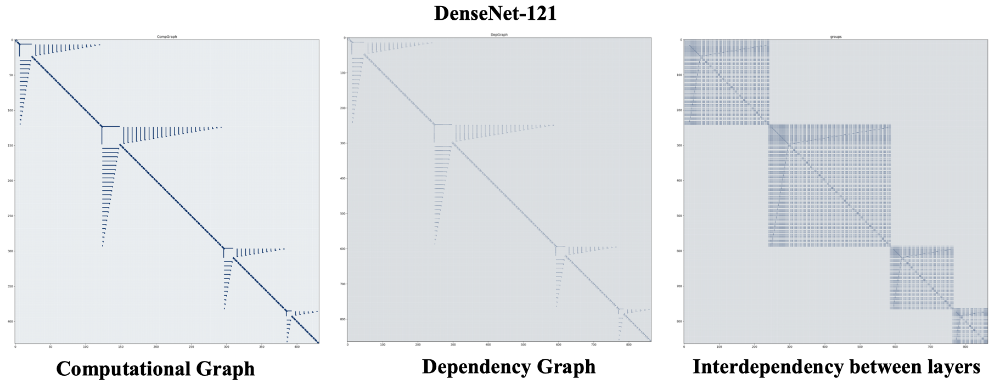

<div align="center"> <h1>Torch-Pruning <br> <h3>Structural Pruning for Model Acceleration<h3> </h1> </div>
<div align="center">

</div>

Torch-Pruning is a general-purpose library for structural network pruning, which supports a large variaty of nerual networks like Vision Transformers, ResNet, DenseNet, RegNet, ResNext, FCN, DeepLab, VGG, etc. Please refer to [tests/test_torchvision_models.py](tests/test_torchvision_models.py) for more details about prunable models.


Pruning is a popular approach to reduce the heavy computational cost of neural networks by removing redundancies. Existing pruning methods prune networks in a case-by-case way, i.e., writing **different code for different models**. However, with the network designs being more and more complicated, applying traditional pruning algorithms to modern neural networks is very difficult. One of the most prominent problems in pruning comes from layer dependencies, where several layers are coupled and must be pruned simultaneously to guarantee the correctness of networks. This project provides the ability of detecting and handling layer dependencies, which allows us to prune complicated networks without too much human effort.

### **Features:**
* Channel pruning for [CNNs](tests/test_torchvision_models.py) (e.g. ResNet, DenseNet, Deeplab) and [Transformers](tests/test_torchvision_models.py) (e.g. ViT)
* High-level pruners: LocalMagnitudePruner, GlobalMagnitudePruner, BNScalePruner, etc.
* Graph Tracing and dependency fixing.
* Supported modules: Conv, Linear, BatchNorm, LayerNorm, Transposed Conv, PReLU, Embedding, MultiheadAttention, nn.Parameters and [customized modules](tests/test_customized_layer.py).
* Supported operations: split, concatenation, skip connection, flatten, etc.
* Pruning strategies: Random, L1, L2, etc.
* Low-level pruning [functions](torch_pruning/prune/structured.py)

### How it works
Torch-Pruning provides some built-in mechanisms for network tracing, which run your model and then trace the computational graph just like ``torch.jit``. Further, a dependency graph will be established to record the dependency between all possible pruning operations. If you prune a single layer, torch-pruning will collect all affected layers by propagating your pruning operation on the dependency graph, and then return a `PruningPlan` for final pruning. All pruning indices will be automatically transformed and aligned if there are operations like ``torch.split`` or ``torch.cat``. 

The pipeline can be visualized as the following images:

1. Trace the model as computational graph
2. Build dependency graph.
3. Propagate your pruning operation on the graph to find affected layers. 

<div align="center">

</div>

### Updates:
**02/07/2022** The latest version is under development in branch [v1.0](https://github.com/VainF/Torch-Pruning/tree/v1.0).

**24/03/2022** We are drafting a paper to provide more technical details about this repo, which will be released as soon as possible, together with a new version and some practical examples for yolo and other popular networks.
 
### Some Plans for v1.0
* High-level pruners like MagnitudeBasedPruner (:heavy_check_mark:), TaylerBasedPruner (:heavy_check_mark:), and [Slimming Pruner (ICCV'17)](https://openaccess.thecvf.com/content_iccv_2017/html/Liu_Learning_Efficient_Convolutional_ICCV_2017_paper.html) (:heavy_check_mark:).
* Support more Transformers like Vision Transformers (:heavy_check_mark:), Swin Transformers, PoolFormers.
* A pruning benchmark on CIFAR100 (:heavy_check_mark:), ImageNet, 3D Point Cloud, Text, ...
* More examples for detection and segmentation.
* A paper about this repo: title => abstract => introduction => methodology => experiments(now we are here! :turtle:) => conclusion.
  
## Installation

```bash
git clone https://github.com/VainF/Torch-Pruning.git # recommended
```

If you would like to try the latest version with more robust design and some tutorials, please try:
```bash
cd Torch-Pruning
git checkout v1.0 # The interfaces in v1.0 may be slightly different.
```

## Quickstart
  
### 0. Dependency

|  Dependency           |  Visualization  |  Example   |
| :------------------:  | :------------:  | :-----:    |
|    Conv-Conv          |   | AlexNet  |
|    Conv-FC (Global Pooling or Flatten) |     | ResNet, VGG    |  
|    Skip Connection    |    | ResNet
|    Concatenation      |      | DenseNet, ASPP |
|    Split              |       | torch.chunk |


### 1. A minimal example

```python
import torch
from torchvision.models import resnet18
import torch_pruning as tp

model = resnet18(pretrained=True).eval()

# 1. setup strategy (L1 Norm)
strategy = tp.strategy.L1Strategy() # or tp.strategy.RandomStrategy()

# 2. build dependency graph for resnet18
DG = tp.DependencyGraph()
DG.build_dependency(model, example_inputs=torch.randn(1,3,224,224))

# 3. get a pruning plan from the dependency graph.
pruning_idxs = strategy(model.conv1.weight, amount=0.4) # or pruning_idxs=[2, 6, 9, ...]
pruning_plan = DG.get_pruning_plan( model.conv1, tp.prune_conv_out_channel, idxs=pruning_idxs )
print(pruning_plan)

# 4. execute this plan after checking (prune the model)
#    if the plan prunes some channels to zero, 
#    DG.check_pruning plan will return False.
if DG.check_pruning_plan(pruning_plan):
    pruning_plan.exec()
```

Pruning the resnet.conv1 will affect several layers. Let's inspect the pruning plan (with pruning_idxs=[2, 6, 9]). You can also customize the metrics following [test_metrics.py](tests/test_metrics.py).

```
--------------------------------
          Pruning Plan
--------------------------------
User pruning:
[ [DEP] ConvOutChannelPruner on conv1 (Conv2d(3, 64, kernel_size=(7, 7), stride=(2, 2), padding=(3, 3), bias=False)) => ConvOutChannelPruner on conv1 (Conv2d(3, 64, kernel_size=(7, 7), stride=(2, 2), padding=(3, 3), bias=False)), Index=[0, 2, 6], metric={'#params': 441}]

Coupled pruning:
[ [DEP] ConvOutChannelPruner on conv1 (Conv2d(3, 64, kernel_size=(7, 7), stride=(2, 2), padding=(3, 3), bias=False)) => BatchnormPruner on bn1 (BatchNorm2d(64, eps=1e-05, momentum=0.1, affine=True, track_running_stats=True)), Index=[0, 2, 6], metric={'#params': 6}]
[ [DEP] BatchnormPruner on bn1 (BatchNorm2d(64, eps=1e-05, momentum=0.1, affine=True, track_running_stats=True)) => ElementWiseOpPruner on _ElementWiseOp(ReluBackward0), Index=[0, 2, 6], metric={}]
[ [DEP] ElementWiseOpPruner on _ElementWiseOp(ReluBackward0) => ElementWiseOpPruner on _ElementWiseOp(MaxPool2DWithIndicesBackward0), Index=[0, 2, 6], metric={}]
[ [DEP] ElementWiseOpPruner on _ElementWiseOp(MaxPool2DWithIndicesBackward0) => ElementWiseOpPruner on _ElementWiseOp(AddBackward0), Index=[0, 2, 6], metric={}]
[ [DEP] ElementWiseOpPruner on _ElementWiseOp(MaxPool2DWithIndicesBackward0) => ConvInChannelPruner on layer1.0.conv1 (Conv2d(64, 64, kernel_size=(3, 3), stride=(1, 1), padding=(1, 1), bias=False)), Index=[0, 2, 6], metric={'#params': 1728}]
[ [DEP] ElementWiseOpPruner on _ElementWiseOp(AddBackward0) => BatchnormPruner on layer1.0.bn2 (BatchNorm2d(64, eps=1e-05, momentum=0.1, affine=True, track_running_stats=True)), Index=[0, 2, 6], metric={'#params': 6}]
[ [DEP] ElementWiseOpPruner on _ElementWiseOp(AddBackward0) => ElementWiseOpPruner on _ElementWiseOp(ReluBackward0), Index=[0, 2, 6], metric={}]
[ [DEP] ElementWiseOpPruner on _ElementWiseOp(ReluBackward0) => ElementWiseOpPruner on _ElementWiseOp(AddBackward0), Index=[0, 2, 6], metric={}]
[ [DEP] ElementWiseOpPruner on _ElementWiseOp(ReluBackward0) => ConvInChannelPruner on layer1.1.conv1 (Conv2d(64, 64, kernel_size=(3, 3), stride=(1, 1), padding=(1, 1), bias=False)), Index=[0, 2, 6], metric={'#params': 1728}]
[ [DEP] ElementWiseOpPruner on _ElementWiseOp(AddBackward0) => BatchnormPruner on layer1.1.bn2 (BatchNorm2d(64, eps=1e-05, momentum=0.1, affine=True, track_running_stats=True)), Index=[0, 2, 6], metric={'#params': 6}]
[ [DEP] ElementWiseOpPruner on _ElementWiseOp(AddBackward0) => ElementWiseOpPruner on _ElementWiseOp(ReluBackward0), Index=[0, 2, 6], metric={}]
[ [DEP] ElementWiseOpPruner on _ElementWiseOp(ReluBackward0) => ConvInChannelPruner on layer2.0.downsample.0 (Conv2d(64, 128, kernel_size=(1, 1), stride=(2, 2), bias=False)), Index=[0, 2, 6], metric={'#params': 384}]
[ [DEP] ElementWiseOpPruner on _ElementWiseOp(ReluBackward0) => ConvInChannelPruner on layer2.0.conv1 (Conv2d(64, 128, kernel_size=(3, 3), stride=(2, 2), padding=(1, 1), bias=False)), Index=[0, 2, 6], metric={'#params': 3456}]
[ [DEP] BatchnormPruner on layer1.1.bn2 (BatchNorm2d(64, eps=1e-05, momentum=0.1, affine=True, track_running_stats=True)) => ConvOutChannelPruner on layer1.1.conv2 (Conv2d(64, 64, kernel_size=(3, 3), stride=(1, 1), padding=(1, 1), bias=False)), Index=[0, 2, 6], metric={'#params': 1728}]
[ [DEP] BatchnormPruner on layer1.0.bn2 (BatchNorm2d(64, eps=1e-05, momentum=0.1, affine=True, track_running_stats=True)) => ConvOutChannelPruner on layer1.0.conv2 (Conv2d(64, 64, kernel_size=(3, 3), stride=(1, 1), padding=(1, 1), bias=False)), Index=[0, 2, 6], metric={'#params': 1728}]

Metric Sum: {'#params': 11211}
--------------------------------
```

Tip: please remember to save the whole model object (weights+architecture) after pruning, instead of saving the weights dict:

```python
# save a pruned model
# torch.save(model.state_dict(), 'model.pth') # weights only
torch.save(model, 'model.pth') # obj (arch + weights), recommended.

# load a pruned model
model = torch.load('model.pth') # no load_state_dict
```

### 2. High-level Pruners

We provide some model-level pruners in this repo. You can specify the channel sparsity to prune the whole model and fintune it using your own training code. Please refer to [tests/test_pruner.py](tests/test_pruner.py) for more details. More examples can be found in [benchmarks/main.py](benchmarks/main.py).

```python
import torch
from torchvision.models import densenet121 as entry
import torch_pruning as tp

model = entry(pretrained=True)
print(model)

ori_size = tp.utils.count_params(model)
example_inputs = torch.randn(1, 3, 224, 224)
imp = tp.importance.MagnitudeImportance(p=2) # L2 norm pruning
ignored_layers = []
for m in model.modules():
    if isinstance(m, torch.nn.Linear) and m.out_features == 1000:
        ignored_layers.append(m)

total_steps = 5 
pruner = tp.pruner.LocalMagnitudePruner( 
    model,
    example_inputs,
    importance=imp,
    total_steps=total_steps, # number of iterations
    ch_sparsity=0.5, # channel sparsity
    ignored_layers=ignored_layers, # ignored_layers will not be pruned
)

for i in range(total_steps): # iterative pruning
    pruner.step()
    print(
        "  Params: %.2f M => %.2f M"
        % (ori_size / 1e6, tp.utils.count_params(model) / 1e6)
    )
    # Your training code here
    # train(...)
```

### 3. Low-level pruning functions

You can prune your model manually without DependencyGraph:

```python
tp.prune_conv_out_channel( model.conv1, idxs=[2,6,9] )

# fix the broken dependencies manually
tp.prune_batchnorm( model.bn1, idxs=[2,6,9] )
tp.prune_conv_in_channel( model.layer2[0].conv1, idxs=[2,6,9] )
...
```

The following pruning functions are available:

```python
tp.prune_conv_in_channel
tp.prune_conv_out_channel
tp.prune_group_conv
tp.prune_batchnorm 
tp.prune_linear_in_channel 
tp.prune_linear_out_channel 
tp.prune_prelu
tp.prune_layernorm 
tp.prune_embedding 
tp.prune_parameter
tp.prune_multihead_attention
```


### 4. Group Convs
We provide a tool `tp.helpers.gconv2convs()`  to transform Group Conv to a group of vanilla convs. Please refer to [test_convnext.py](tests/test_convnext.py) for more details.

### 5. Customized Layers

Please refer to [examples/customized_layer.py](https://github.com/VainF/Torch-Pruning/blob/master/examples/customized_layer.py).

### 6. Rounding channels for device-friendly network pruning
You can round the channels by passing a `round_to` parameter to strategy. For example, the following script will round the number of channels to 16xN (e.g., 16, 32, 48, 64).
```python
strategy = tp.strategy.L1Strategy()
pruning_idxs = strategy(model.conv1.weight, amount=0.2, round_to=16)
```
Please refer to [https://github.com/VainF/Torch-Pruning/issues/38](https://github.com/VainF/Torch-Pruning/issues/38) for more details.

### 7. Example: pruning ResNet18 on Cifar10

#### 7.1. Scratch training
```bash
cd examples/cifar_minimal
python prune_resnet18_cifar10.py --mode train # 11.1M, Acc=0.9248
```

#### 7.2. Pruning and fintuning
```bash
python prune_resnet18_cifar10.py --mode prune --round 1 --total_epochs 30 --step_size 20 # 4.5M, Acc=0.9229
python prune_resnet18_cifar10.py --mode prune --round 2 --total_epochs 30 --step_size 20 # 1.9M, Acc=0.9207
python prune_resnet18_cifar10.py --mode prune --round 3 --total_epochs 30 --step_size 20 # 0.8M, Acc=0.9176
python prune_resnet18_cifar10.py --mode prune --round 4 --total_epochs 30 --step_size 20 # 0.4M, Acc=0.9102
python prune_resnet18_cifar10.py --mode prune --round 5 --total_epochs 30 --step_size 20 # 0.2M, Acc=0.9011
...
```

## Layer Dependency

During structured pruning, we need to maintain the channel consistency between different layers. 

### A Simple Case


### More Complicated Cases

the layer dependency becomes much more complicated when the model contains skip connections or concatenations. 

#### Residual Block: 


#### Concatenation: 


See paper [Pruning Filters for Efficient ConvNets](https://arxiv.org/abs/1608.08710) for more details.

# Citation
If you find this repo helpful, please cite:
```
@software{Fang_Torch-Pruning_2022,
  author = {Fang, Gongfan},
  month = {7},
  title = {{Torch-Pruning}},
  url = {https://github.com/VainF/Torch-Pruning},
  version = {0.2.8},
  year = {2022}
}
```
