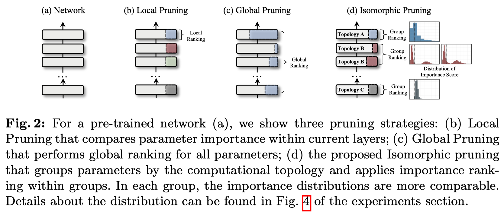

<div align="center">
</img>
<h2></h2>
<h3>Towards Any Structural Pruning<h3>

</div>

<p align="center">
  <a href="https://github.com/VainF/Torch-Pruning/actions"></a>
  <a href="https://pytorch.org/"></a>
  <a href="https://opensource.org/licenses/MIT"></a>
  <a href="https://pepy.tech/project/Torch-Pruning"></a>
  <a href="https://github.com/VainF/Torch-Pruning/releases/latest"></a>
  <a href="https://colab.research.google.com/drive/1TRvELQDNj9PwM-EERWbF3IQOyxZeDepp?usp=sharing">
  
</a>
  <a href="https://arxiv.org/abs/2301.12900" target="_blank"></a>
</p>

Torch-Pruning (TP) is a framework for structural pruning with the following features:

*  **General-purpose Pruning Toolkit:** TP enables structural pruning for a wide range of deep neural networks. Different from [torch.nn.utils.prune](https://pytorch.org/tutorials/intermediate/pruning_tutorial.html) that zeroizes parameters via masking, Torch-Pruning deploys an algorithm called ⚡ **[DepGraph](https://openaccess.thecvf.com/content/CVPR2023/html/Fang_DepGraph_Towards_Any_Structural_Pruning_CVPR_2023_paper.html)** to group and remove coupled parameters. 
* **Examples**: Pruning off-the-shelf models from Huggingface, Timm, Torchvision, including [Large Language Models (LLMs)](https://github.com/VainF/Torch-Pruning/tree/master/examples/LLMs), [Segment Anything Model (SAM)](https://github.com/czg1225/SlimSAM), [Diffusion Models](https://github.com/VainF/Diff-Pruning), [Vision Transformers](https://github.com/VainF/Isomorphic-Pruning), [ConvNext](https://github.com/VainF/Isomorphic-Pruning), [Yolov7](examples/yolov7/), [yolov8](examples/yolov8/),  [Swin Transformers](examples/transformers#swin-transformers-from-hf-transformers), [BERT](examples/transformers#bert-from-hf-transformers), FasterRCNN, SSD, ResNe(X)t, DenseNet, RegNet, DeepLab, etc. A detailed list can be found in 🎨 [Examples](examples).


For more technical details, please refer to our CVPR'23 paper.
> [**DepGraph: Towards Any Structural Pruning**](https://openaccess.thecvf.com/content/CVPR2023/html/Fang_DepGraph_Towards_Any_Structural_Pruning_CVPR_2023_paper.html)   
> *[Gongfan Fang](https://fangggf.github.io/), [Xinyin Ma](https://horseee.github.io/), [Mingli Song](https://person.zju.edu.cn/en/msong), [Michael Bi Mi](https://dblp.org/pid/317/0937.html), [Xinchao Wang](https://sites.google.com/site/sitexinchaowang/)*    
> *[xML Lab](https://sites.google.com/view/xml-nus), National University of Singapore*


### Update:
- 🔥 2025.03.24  Examples for pruning [**DeepSeek-R1-Distill**](https://github.com/VainF/Torch-Pruning/tree/master/examples/LLMs).
- 🔥 2024.11.17  We are working to add more [**examples for LLMs**](https://github.com/VainF/Torch-Pruning/tree/master/examples/LLMs), such as Llama-2/3, Phi-3, Qwen-2/2.5.  
- 🔥 2024.09.27  Check our latest work, [**MaskLLM (NeurIPS 24 Spotlight)**](https://github.com/NVlabs/MaskLLM), for learnable semi-structured sparsity of LLMs.
- 🔥 2024.07.20  Add [**Isomorphic Pruning (ECCV'24)**](https://arxiv.org/abs/2407.04616). A SOTA method for Vision Transformers and Modern CNNs.

### **Contact Us:**
Please do not hesitate to open an [issue](https://github.com/VainF/Torch-Pruning/issues) if you encounter any problems with the library or the paper.   
Or Join our WeChat group for more discussions: ✉️ [Group-2](https://github.com/user-attachments/assets/3fe4c487-5a5b-43fd-bf64-a5ee62c3dec1) (>200/500), ✉️ [Group-1](https://github.com/VainF/Torch-Pruning/assets/18592211/35d66130-eb03-4dcb-ad75-8df784460ad3) (500/500, FULL).

## Table of Contents
- [Installation](#installation)
- [Quickstart](#quickstart)
   - [Why Torch-Pruning?](#why-torch-pruning)
   - [How It Works: DepGraph](#how-it-works-depgraph)
   - [High-level Pruners](#high-level-pruners)
     - [Global Pruning and Isomorphic Pruning](#global-pruning-and-isomorphic-pruning)
     - [Pruning Ratios](#pruning-ratios)
     - [Sparse Training (Optional)](#sparse-training-optional)
     - [Interactive Pruning](#interactive-pruning)
     - [Pruning by Masking](#pruning-by-masking)
     - [Group-level Pruning](#group-level-pruning)
     - [Modify static attributes or forward functions](#modify-static-attributes-or-forward-functions)
   - [Save & Load](#save-and-load)
   - [Low-level Pruning Functions](#low-level-pruning-functions)
   - [Customized Layers](#customized-layers)
   - [Reproduce Paper Results](#reproduce-paper-results)
     - [Our Results on {ResNet-56 / CIFAR-10 / 2.00x}](#our-results-on-resnet-56--cifar-10--200x)
     - [Latency](#latency)
   - [Series of Works](#series-of-works)
- [Citation](#citation)

## Installation

Torch-Pruning only relies on PyTorch and Numpy, and it is compatible with PyTorch 1.x and 2.x. To install the latest version, run the following command:

```bash
pip install torch-pruning --upgrade
```
For editable installation:
```bash
git clone https://github.com/VainF/Torch-Pruning.git
cd Torch-Pruning && pip install -e .
```

## Quickstart
  
Here we provide a quick start for Torch-Pruning. More explained details can be found in [Tutorals](https://github.com/VainF/Torch-Pruning/wiki)

### Why Torch-Pruning?

In structural pruning, the removal of a single parameter may affect multiple layers. For example, pruning an output dimension of a linear layer will require the removal of the corresponding input dimension in the following linear layer as shown in (a). This dependency between layers makes it challenging to prune complicated networks manually. Torch-Pruning addresses this issue by introducing a graph-based algorithm called **[DepGraph](https://openaccess.thecvf.com/content/CVPR2023/html/Fang_DepGraph_Towards_Any_Structural_Pruning_CVPR_2023_paper.html)** to automatically identify dependencies and collect groups for pruning.

<div align="center">

</div>

### How It Works: DepGraph
 
> [!IMPORTANT]  
> Please make sure that AutoGrad is enabled since TP will analyze the model structure with the Pytorch AutoGrad. This means we need to remove ``torch.no_grad()`` or something similar when building the dependency graph.

```python
import torch
from torchvision.models import resnet18
import torch_pruning as tp

model = resnet18(pretrained=True).eval()

# 1. Build dependency graph for a resnet18. This requires a dummy input for forwarding
DG = tp.DependencyGraph().build_dependency(model, example_inputs=torch.randn(1,3,224,224))

# 2. To prune the output channels of model.conv1, we need to find the corresponding group with a pruning function and pruning indices.
group = DG.get_pruning_group( model.conv1, tp.prune_conv_out_channels, idxs=[2, 6, 9] )

# 3. Do the pruning
if DG.check_pruning_group(group): # avoid over-pruning, i.e., channels=0.
    group.prune()
    
# 4. Save & Load
model.zero_grad() # clear gradients to avoid a large file size
torch.save(model, 'model.pth') # !! no .state_dict here since the structure has been changed after pruning
model = torch.load('model.pth') # load the pruned model. you may need torch.load('model.pth', weights_only=False) for PyTorch 2.6.0+.
```
The above example shows the core algorithm, DepGraph, that captures the dependencies in structural pruning. The target layer `model.conv1` is coupled with multiple layers, necessitating their simultaneous removal in structural pruning. We can print the group to take a look at the internal dependencies. In the subsequent outputs, "A => B" indicates that pruning operation "A" triggers pruning operation "B." The first group[0] refers to the root of pruning. For more details about grouping, please refer to [Wiki - DepGraph & Group](https://github.com/VainF/Torch-Pruning/wiki/3.-DepGraph-&-Group).

```python
print(group.details()) # or print(group)
```
```
--------------------------------
          Pruning Group
--------------------------------
[0] prune_out_channels on conv1 (Conv2d(3, 61, kernel_size=(7, 7), stride=(2, 2), padding=(3, 3), bias=False)) => prune_out_channels on conv1 (Conv2d(3, 61, kernel_size=(7, 7), stride=(2, 2), padding=(3, 3), bias=False)), idxs (3) =[2, 6, 9]  (Pruning Root)
[1] prune_out_channels on conv1 (Conv2d(3, 61, kernel_size=(7, 7), stride=(2, 2), padding=(3, 3), bias=False)) => prune_out_channels on bn1 (BatchNorm2d(61, eps=1e-05, momentum=0.1, affine=True, track_running_stats=True)), idxs (3) =[2, 6, 9] 
[2] prune_out_channels on bn1 (BatchNorm2d(61, eps=1e-05, momentum=0.1, affine=True, track_running_stats=True)) => prune_out_channels on _ElementWiseOp_20(ReluBackward0), idxs (3) =[2, 6, 9] 
[3] prune_out_channels on _ElementWiseOp_20(ReluBackward0) => prune_out_channels on _ElementWiseOp_19(MaxPool2DWithIndicesBackward0), idxs (3) =[2, 6, 9] 
[4] prune_out_channels on _ElementWiseOp_19(MaxPool2DWithIndicesBackward0) => prune_out_channels on _ElementWiseOp_18(AddBackward0), idxs (3) =[2, 6, 9] 
[5] prune_out_channels on _ElementWiseOp_19(MaxPool2DWithIndicesBackward0) => prune_in_channels on layer1.0.conv1 (Conv2d(61, 64, kernel_size=(3, 3), stride=(1, 1), padding=(1, 1), bias=False)), idxs (3) =[2, 6, 9] 
[6] prune_out_channels on _ElementWiseOp_18(AddBackward0) => prune_out_channels on layer1.0.bn2 (BatchNorm2d(61, eps=1e-05, momentum=0.1, affine=True, track_running_stats=True)), idxs (3) =[2, 6, 9] 
[7] prune_out_channels on _ElementWiseOp_18(AddBackward0) => prune_out_channels on _ElementWiseOp_17(ReluBackward0), idxs (3) =[2, 6, 9] 
[8] prune_out_channels on _ElementWiseOp_17(ReluBackward0) => prune_out_channels on _ElementWiseOp_16(AddBackward0), idxs (3) =[2, 6, 9] 
[9] prune_out_channels on _ElementWiseOp_17(ReluBackward0) => prune_in_channels on layer1.1.conv1 (Conv2d(61, 64, kernel_size=(3, 3), stride=(1, 1), padding=(1, 1), bias=False)), idxs (3) =[2, 6, 9] 
[10] prune_out_channels on _ElementWiseOp_16(AddBackward0) => prune_out_channels on layer1.1.bn2 (BatchNorm2d(61, eps=1e-05, momentum=0.1, affine=True, track_running_stats=True)), idxs (3) =[2, 6, 9] 
[11] prune_out_channels on _ElementWiseOp_16(AddBackward0) => prune_out_channels on _ElementWiseOp_15(ReluBackward0), idxs (3) =[2, 6, 9] 
[12] prune_out_channels on _ElementWiseOp_15(ReluBackward0) => prune_in_channels on layer2.0.downsample.0 (Conv2d(61, 128, kernel_size=(1, 1), stride=(2, 2), bias=False)), idxs (3) =[2, 6, 9] 
[13] prune_out_channels on _ElementWiseOp_15(ReluBackward0) => prune_in_channels on layer2.0.conv1 (Conv2d(61, 128, kernel_size=(3, 3), stride=(2, 2), padding=(1, 1), bias=False)), idxs (3) =[2, 6, 9] 
[14] prune_out_channels on layer1.1.bn2 (BatchNorm2d(61, eps=1e-05, momentum=0.1, affine=True, track_running_stats=True)) => prune_out_channels on layer1.1.conv2 (Conv2d(64, 61, kernel_size=(3, 3), stride=(1, 1), padding=(1, 1), bias=False)), idxs (3) =[2, 6, 9] 
[15] prune_out_channels on layer1.0.bn2 (BatchNorm2d(61, eps=1e-05, momentum=0.1, affine=True, track_running_stats=True)) => prune_out_channels on layer1.0.conv2 (Conv2d(64, 61, kernel_size=(3, 3), stride=(1, 1), padding=(1, 1), bias=False)), idxs (3) =[2, 6, 9] 
--------------------------------
```

#### How to scan all groups (Advanced):
There might be many groups in a model. We can use ``DG.get_all_groups(ignored_layers, root_module_types)`` to scan all prunable groups sequentially. Each group will begin with a layer that matches the one ``nn.Module`` class in ``root_module_types``. The ``ignored_layers`` parameter is used to skip some layers that should not be pruned. For example, we can skip the first convolution layer in a ResNet model. 

```python
for group in DG.get_all_groups(ignored_layers=[model.conv1], root_module_types=[nn.Conv2d, nn.Linear]):
    # Handle groups in sequential order
    idxs = [2,4,6] # your pruning indices, feel free to change them
    group.prune(idxs=idxs)
    print(group)
```

### High-level Pruners

> [!NOTE]  
> **The pruning ratio**: In TP, the ``pruning_ratio`` refers to the pruning ratio of channels/dims. Since both in & out dims will be removed by $p$, the actual ``parameter_pruning_ratio`` of  will be roughly $1-(1-p)^2$. To remove 50% of parameters, you may use ``pruning_ratio=0.30`` instead, which leads to the actual parameter pruning ratio of `$1-(1-0.3)^2=0.51$ (51% parameters removed).

With DepGraph, we developed several high-level pruners to facilitate effortless pruning. By specifying the desired channel pruning ratio, the pruner will scan all prunable groups, estimate weight importance and perform pruning. You can fine-tune the remaining weights using your own training code. For detailed information on this process, please refer to [this tutorial](https://github.com/VainF/Torch-Pruning/blob/master/examples/notebook/1%20-%20Customize%20Your%20Own%20Pruners.ipynb), which shows how to implement a [Network Slimming (ICCV 2017)](https://arxiv.org/abs/1708.06519) pruner from scratch. Additionally, a more practical example is available in [VainF/Isomorphic-Pruning](https://github.com/VainF/Isomorphic-Pruning) for ViT and ConvNext pruning.

```python
import torch
from torchvision.models import resnet18
import torch_pruning as tp

model = resnet18(pretrained=True)
example_inputs = torch.randn(1, 3, 224, 224)

# 1. Importance criterion, here we calculate the L2 Norm of grouped weights as the importance score
imp = tp.importance.GroupMagnitudeImportance(p=2) 

# 2. Initialize a pruner with the model and the importance criterion
ignored_layers = []
for m in model.modules():
    if isinstance(m, torch.nn.Linear) and m.out_features == 1000:
        ignored_layers.append(m) # DO NOT prune the final classifier!

pruner = tp.pruner.BasePruner( # We can always choose BasePruner if sparse training is not required.
    model,
    example_inputs,
    importance=imp,
    pruning_ratio=0.5, # remove 50% channels, ResNet18 = {64, 128, 256, 512} => ResNet18_Half = {32, 64, 128, 256}
    # pruning_ratio_dict = {model.conv1: 0.2, model.layer2: 0.8}, # customized pruning ratios for layers or blocks
    ignored_layers=ignored_layers,
    round_to=8, # It's recommended to round dims/channels to 4x or 8x for acceleration. Please see: https://docs.nvidia.com/deeplearning/performance/dl-performance-convolutional/index.html
)

# 3. Prune the model
base_macs, base_nparams = tp.utils.count_ops_and_params(model, example_inputs)
tp.utils.print_tool.before_pruning(model) # or print(model)
pruner.step()
tp.utils.print_tool.after_pruning(model) # or print(model), this util will show the difference before and after pruning
macs, nparams = tp.utils.count_ops_and_params(model, example_inputs)
print(f"MACs: {base_macs/1e9} G -> {macs/1e9} G, #Params: {base_nparams/1e6} M -> {nparams/1e6} M")


# 4. finetune the pruned model using your own code.
# finetune(model)
# ...
```

<details>
  <summary>Output</summary>
  
The model difference before and after pruning will be highlighted by something like `(conv1): Conv2d(3, 64, kernel_size=(7, 7), stride=(2, 2), padding=(3, 3), bias=False) => (conv1): Conv2d(3, 32, kernel_size=(7, 7), stride=(2, 2), padding=(3, 3), bias=False)`.
```
ResNet(
  (conv1): Conv2d(3, 64, kernel_size=(7, 7), stride=(2, 2), padding=(3, 3), bias=False) => (conv1): Conv2d(3, 32, kernel_size=(7, 7), stride=(2, 2), padding=(3, 3), bias=False)
  (bn1): BatchNorm2d(64, eps=1e-05, momentum=0.1, affine=True, track_running_stats=True) => (bn1): BatchNorm2d(32, eps=1e-05, momentum=0.1, affine=True, track_running_stats=True)
  (relu): ReLU(inplace=True)
  (maxpool): MaxPool2d(kernel_size=3, stride=2, padding=1, dilation=1, ceil_mode=False)
...
     (1): BasicBlock(
      (conv1): Conv2d(512, 512, kernel_size=(3, 3), stride=(1, 1), padding=(1, 1), bias=False) => (conv1): Conv2d(256, 256, kernel_size=(3, 3), stride=(1, 1), padding=(1, 1), bias=False)
      (bn1): BatchNorm2d(512, eps=1e-05, momentum=0.1, affine=True, track_running_stats=True) => (bn1): BatchNorm2d(256, eps=1e-05, momentum=0.1, affine=True, track_running_stats=True)
      (relu): ReLU(inplace=True)
      (conv2): Conv2d(512, 512, kernel_size=(3, 3), stride=(1, 1), padding=(1, 1), bias=False) => (conv2): Conv2d(256, 256, kernel_size=(3, 3), stride=(1, 1), padding=(1, 1), bias=False)
      (bn2): BatchNorm2d(512, eps=1e-05, momentum=0.1, affine=True, track_running_stats=True) => (bn2): BatchNorm2d(256, eps=1e-05, momentum=0.1, affine=True, track_running_stats=True)
    )
  )
  (avgpool): AdaptiveAvgPool2d(output_size=(1, 1))
  (fc): Linear(in_features=512, out_features=1000, bias=True) => (fc): Linear(in_features=256, out_features=1000, bias=True)
)

MACs: 1.822177768 G -> 0.487202536 G, #Params: 11.689512 M -> 3.05588 M
```
</details>


#### Global Pruning and Isomorphic Pruning
Global pruning performs importance ranking on all layers, which has the potential to find better structures. This can be easily achieved by setting ``global_pruning=True`` in the pruner. While this strategy can possibly offer performance advantages, it also carries the potential of overly pruning specific layers, resulting in a substantial decline in overall performance. We provide an alternative algorithm called [Isomorphic Pruning](https://arxiv.org/abs/2407.04616) to alleviate this issue, which can be enabled with ``isomorphic=True``. Comprehensive examples for ViT & ConvNext pruning are available in [this project](https://github.com/VainF/Isomorphic-Pruning).

```python
pruner = tp.pruner.BasePruner(
    ...
    isomorphic=True, # enable isomorphic pruning to improve global ranking
    global_pruning=True, # global pruning
)
```

<div align="center">

</div>

#### Pruning Ratios

The argument ``pruning_ratio`` detemines the default pruning ratio. If you want to customize the pruning ratio for some layers or blocks, you can use ``pruning_ratio_dict``. The key of the dict can be a single ``nn.Module`` or a tuple of ``nn.Module``. In the second case, all modules in the tuple will form a ``scope`` and share the user-defined pruning ratio and compete to be pruned. 
```python
pruner = tp.pruner.BasePruner(
    ...
    global_pruning=True,
    pruning_ratio=0.5, # default pruning ratio
    # layer1 & layer2 will share a total pruning ratio of 0.4 while layer 3 will have a pruning ratio of 0.2
    pruning_ratio_dict = {(model.layer1, model.layer2): 0.4, model.layer3: 0.2}, 
)
```

#### Sparse Training (Optional)
Some pruners like [BNScalePruner](https://github.com/VainF/Torch-Pruning/blob/dd59921365d72acb2857d3d74f75c03e477060fb/torch_pruning/pruner/algorithms/batchnorm_scale_pruner.py#L45) and [GroupNormPruner](https://github.com/VainF/Torch-Pruning/blob/dd59921365d72acb2857d3d74f75c03e477060fb/torch_pruning/pruner/algorithms/group_norm_pruner.py#L53) support sparse training. This can be easily achieved by inserting ``pruner.update_regularizer()`` and ``pruner.regularize(model)`` in your standard training loops. The pruner will accumulate the regularization gradients to ``.grad``. Sparse training is optional and may not always gaurentee better performance. Be careful when using it.
```python
for epoch in range(epochs):
    model.train()
    pruner.update_regularizer() # <== initialize regularizer
    for i, (data, target) in enumerate(train_loader):
        data, target = data.to(device), target.to(device)
        optimizer.zero_grad()
        out = model(data)
        loss = F.cross_entropy(out, target)
        loss.backward() # after loss.backward()
        pruner.regularize(model) # <== for sparse training
        optimizer.step() # before optimizer.step()
```

#### Interactive Pruning
All high-level pruners offer support for interactive pruning. You can utilize the method `pruner.step(interactive=True)` to retrieve all the groups and interactively prune them by calling `group.prune()`. This feature is particularly useful if you want to control or monitor the pruning process.

```python
for i in range(iterative_steps):
    for group in pruner.step(interactive=True): # Warning: groups must be handled sequentially. Do not keep them as a list.
        print(group) 
        # do whatever you like with the group 
        dep, idxs = group[0] # get the idxs
        target_module = dep.target.module # get the root module
        pruning_fn = dep.handler # get the pruning function
        group.prune()
        # group.prune(idxs=[0, 2, 6]) # It is even possible to change the pruning behaviour with the idxs parameter
    macs, nparams = tp.utils.count_ops_and_params(model, example_inputs)
    # finetune your model here
    # finetune(model)
    # ...
```

#### Pruning by Masking

It is possible to implement masking-based Pruning leveraging ``interactive=True``, which zeros out parameters without removing them. An example can be found in [tests/test_soft_pruning.py](https://github.com/VainF/Torch-Pruning/blob/c9cea192a31f64e5ea26c095a70e2e93acf0be77/tests/test_soft_pruning.py#L39)

#### Group-level Pruning

With DepGraph, it is easy to design some "group-level" importance scores to estimate the importance of a whole group rather than a single layer. This feature can be also used to sparsify coupled layers, making all the to-be-pruned parameters consistently sparse. In Torch-pruning, all pruners work at the group level. Check the following results to see how grouping improves the performance of pruning.

<div align="center">

</div>

* Pruning a ResNet50 pre-trained on ImageNet-1K without fine-tuning.
<div align="center">
</img>
</img>
</div>

* Pruning a Vision Transformer pre-trained on ImageNet-1K without fine-tuning.
<div align="center">
</img>
</img>
</div>

#### Modify static attributes or forward functions

In some implementations, model forwarding might rely on static attributes. For example in [``convformer_s18``](https://github.com/huggingface/pytorch-image-models/blob/054c763fcaa7d241564439ae05fbe919ed85e614/timm/models/metaformer.py#L107) of timm, we have ``self.shape`` which will be changed after pruning. These attributes should be updated manually since it is impossible for TP to know the purpose of these attributes. 

```python
class Scale(nn.Module):
    """
    Scale vector by element multiplications.
    """

    def __init__(self, dim, init_value=1.0, trainable=True, use_nchw=True):
        super().__init__()
        self.shape = (dim, 1, 1) if use_nchw else (dim,) # static shape, which should be updated after pruning
        self.scale = nn.Parameter(init_value * torch.ones(dim), requires_grad=trainable)

    def forward(self, x):
        return x * self.scale.view(self.shape) # => x * self.scale.view(-1, 1, 1), this works for pruning
```


### Save and Load

The following script saves the whole model object (structure+weights) as a 'model.pth'. You can load it using the standard PyTorch API. Just remember that we save and load the whole model **without** ``.state_dict`` or ``.load_state_dict``, since the pruned sturctured will be different from the original definition in your ``model.py``. 
```python
model.zero_grad() # Remove gradients
torch.save(model, 'model.pth') # without .state_dict
model = torch.load('model.pth') # load the pruned model
# For PyTorch 2.6.0+, you may need weights_only=False to enable model loading
# model = torch.load('model.pth', weights_only=False)
```
                   
### Low-level Pruning Functions

In Torch-Pruning, we provide a series of low-level pruning functions that only prune a single layer or module. To manually prune the ``model.conv1`` of a ResNet-18, the pruning pipeline should look like this:

```python
tp.prune_conv_out_channels( model.conv1, idxs=[2,6,9] )

# fix the broken dependencies manually
tp.prune_batchnorm_out_channels( model.bn1, idxs=[2,6,9] )
tp.prune_conv_in_channels( model.layer2[0].conv1, idxs=[2,6,9] )
...
```

The following [pruning functions](torch_pruning/pruner/function.py) are available:
```python
'prune_conv_out_channels',
'prune_conv_in_channels',
'prune_depthwise_conv_out_channels',
'prune_depthwise_conv_in_channels',
'prune_batchnorm_out_channels',
'prune_batchnorm_in_channels',
'prune_linear_out_channels',
'prune_linear_in_channels',
'prune_prelu_out_channels',
'prune_prelu_in_channels',
'prune_layernorm_out_channels',
'prune_layernorm_in_channels',
'prune_embedding_out_channels',
'prune_embedding_in_channels',
'prune_parameter_out_channels',
'prune_parameter_in_channels',
'prune_multihead_attention_out_channels',
'prune_multihead_attention_in_channels',
'prune_groupnorm_out_channels',
'prune_groupnorm_in_channels',
'prune_instancenorm_out_channels',
'prune_instancenorm_in_channels',
```

### Customized Layers

Please refer to [examples/transformers/prune_hf_swin.py](examples/transformers/prune_hf_swin.py), which implements a new pruner for the customized module ``SwinPatchMerging``. Another simple example is available at [tests/test_customized_layer.py](https://github.com/VainF/Torch-Pruning/blob/master/tests/test_customized_layer.py).

### Reproduce Paper Results

Please see [reproduce](reproduce).

#### Our results on {ResNet-56 / CIFAR-10 / 2.00x}

| Method | Base (%) | Pruned (%) | $\Delta$ Acc (%) | Speed Up |
|:--    |:--:  |:--:    |:--: |:--:      |
| NIPS [[1]](#1)  | -    | -      |-0.03 | 1.76x    |
| Geometric [[2]](#2) | 93.59 | 93.26 | -0.33 | 1.70x |
| Polar [[3]](#3)  | 93.80 | 93.83 | +0.03 |1.88x |
| CP  [[4]](#4)   | 92.80 | 91.80 | -1.00 |2.00x |
| AMC [[5]](#5)   | 92.80 | 91.90 | -0.90 |2.00x |
| HRank [[6]](#6) | 93.26 | 92.17 | -0.09 |2.00x |
| SFP  [[7]](#7)  | 93.59 | 93.36 | +0.23 |2.11x |
| ResRep [[8]](#8) | 93.71 | 93.71 | +0.00 |2.12x |
||
| Ours-L1 | 93.53 | 92.93 | -0.60 | 2.12x |
| Ours-BN | 93.53 | 93.29 | -0.24 | 2.12x |
| Ours-Group | 93.53 | 93.77 | +0.38 | 2.13x |

#### Latency

Latency test on ResNet-50, Batch Size=64. 
```
[Iter 0]        Pruning ratio: 0.00,         MACs: 4.12 G,   Params: 25.56 M,        Latency: 45.22 ms +- 0.03 ms
[Iter 1]        Pruning ratio: 0.05,         MACs: 3.68 G,   Params: 22.97 M,        Latency: 46.53 ms +- 0.06 ms
[Iter 2]        Pruning ratio: 0.10,         MACs: 3.31 G,   Params: 20.63 M,        Latency: 43.85 ms +- 0.08 ms
[Iter 3]        Pruning ratio: 0.15,         MACs: 2.97 G,   Params: 18.36 M,        Latency: 41.22 ms +- 0.10 ms
[Iter 4]        Pruning ratio: 0.20,         MACs: 2.63 G,   Params: 16.27 M,        Latency: 39.28 ms +- 0.20 ms
[Iter 5]        Pruning ratio: 0.25,         MACs: 2.35 G,   Params: 14.39 M,        Latency: 34.60 ms +- 0.19 ms
[Iter 6]        Pruning ratio: 0.30,         MACs: 2.02 G,   Params: 12.46 M,        Latency: 33.38 ms +- 0.27 ms
[Iter 7]        Pruning ratio: 0.35,         MACs: 1.74 G,   Params: 10.75 M,        Latency: 31.46 ms +- 0.20 ms
[Iter 8]        Pruning ratio: 0.40,         MACs: 1.50 G,   Params: 9.14 M,         Latency: 29.04 ms +- 0.19 ms
[Iter 9]        Pruning ratio: 0.45,         MACs: 1.26 G,   Params: 7.68 M,         Latency: 27.47 ms +- 0.28 ms
[Iter 10]       Pruning ratio: 0.50,         MACs: 1.07 G,   Params: 6.41 M,         Latency: 20.68 ms +- 0.13 ms
[Iter 11]       Pruning ratio: 0.55,         MACs: 0.85 G,   Params: 5.14 M,         Latency: 20.48 ms +- 0.21 ms
[Iter 12]       Pruning ratio: 0.60,         MACs: 0.67 G,   Params: 4.07 M,         Latency: 18.12 ms +- 0.15 ms
[Iter 13]       Pruning ratio: 0.65,         MACs: 0.53 G,   Params: 3.10 M,         Latency: 15.19 ms +- 0.01 ms
[Iter 14]       Pruning ratio: 0.70,         MACs: 0.39 G,   Params: 2.28 M,         Latency: 13.47 ms +- 0.01 ms
[Iter 15]       Pruning ratio: 0.75,         MACs: 0.29 G,   Params: 1.61 M,         Latency: 10.07 ms +- 0.01 ms
[Iter 16]       Pruning ratio: 0.80,         MACs: 0.18 G,   Params: 1.01 M,         Latency: 8.96 ms +- 0.02 ms
[Iter 17]       Pruning ratio: 0.85,         MACs: 0.10 G,   Params: 0.57 M,         Latency: 7.03 ms +- 0.04 ms
[Iter 18]       Pruning ratio: 0.90,         MACs: 0.05 G,   Params: 0.25 M,         Latency: 5.81 ms +- 0.03 ms
[Iter 19]       Pruning ratio: 0.95,         MACs: 0.01 G,   Params: 0.06 M,         Latency: 5.70 ms +- 0.03 ms
[Iter 20]       Pruning ratio: 1.00,         MACs: 0.01 G,   Params: 0.06 M,         Latency: 5.71 ms +- 0.03 ms
```

### Series of Works

> **DepGraph: Towards Any Structural Pruning** [[Project]](https://github.com/VainF/Torch-Pruning) [[Paper]](https://openaccess.thecvf.com/content/CVPR2023/html/Fang_DepGraph_Towards_Any_Structural_Pruning_CVPR_2023_paper.html)   
> *Gongfan Fang, Xinyin Ma, Mingli Song, Michael Bi Mi, Xinchao Wang*  
> CVPR 2023

> **Isomorphic Pruning for Vision Models** [[Project]](https://github.com/VainF/Isomorphic-Pruning) [[Arxiv]](https://arxiv.org/abs/2407.04616)  
> *Gongfan Fang, Xinyin Ma, Michael Bi Mi, Xinchao Wang*   
> ECCV 2024

> **LLM-Pruner: On the Structural Pruning of Large Language Models** [[Project]](https://github.com/horseee/LLM-Pruner) [[arXiv]](https://arxiv.org/abs/2305.11627)   
> *Xinyin Ma, Gongfan Fang, Xinchao Wang*  
> NeurIPS 2023

> **Structural Pruning for Diffusion Models** [[Project]](https://github.com/VainF/Diff-Pruning) [[arxiv]](https://arxiv.org/abs/2305.10924)  
> *Gongfan Fang, Xinyin Ma, Xinchao Wang*  
> NeurIPS 2023

> **DeepCache: Accelerating Diffusion Models for Free** [[Project]](https://github.com/horseee/DeepCache) [[Arxiv]](https://arxiv.org/abs/2312.00858)  
> *Xinyin Ma, Gongfan Fang, and Xinchao Wang*   
> CVPR 2024

> **SlimSAM: 0.1% Data Makes Segment Anything Slim** [[Project]](https://github.com/czg1225/SlimSAM) [[Arxiv]](https://arxiv.org/abs/2312.05284)    
> *Zigeng Chen, Gongfan Fang, Xinyin Ma, Xinchao Wang*   
> Preprint 2023


## Citation
```
@inproceedings{fang2023depgraph,
  title={Depgraph: Towards any structural pruning},
  author={Fang, Gongfan and Ma, Xinyin and Song, Mingli and Mi, Michael Bi and Wang, Xinchao},
  booktitle={Proceedings of the IEEE/CVF Conference on Computer Vision and Pattern Recognition},
  pages={16091--16101},
  year={2023}
}
```

