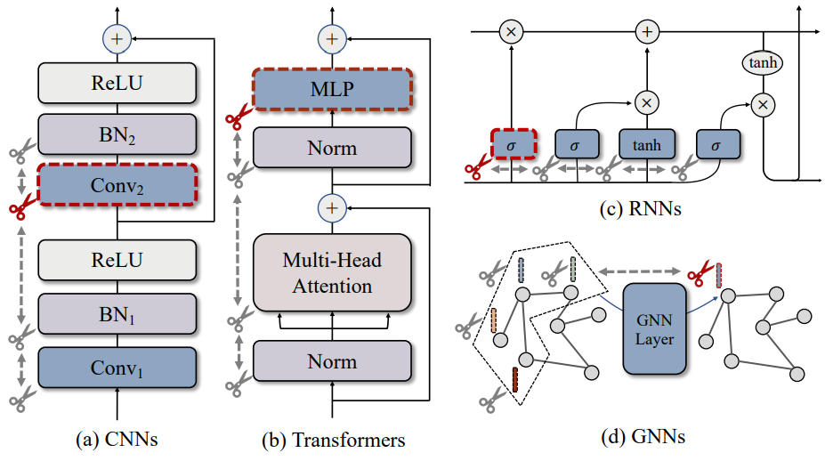
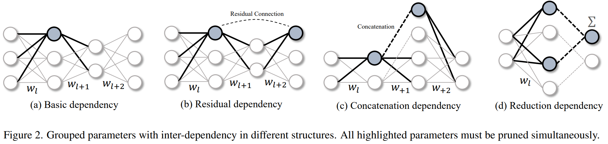
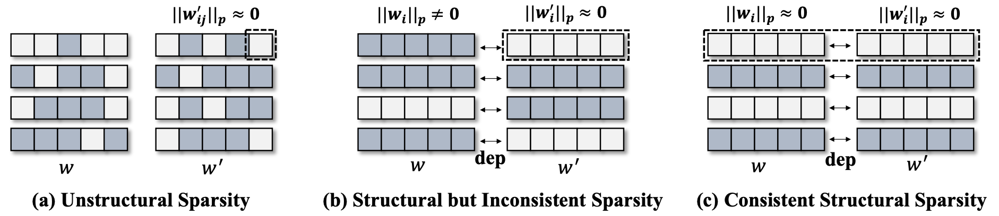

<br>
<div align="center">
</img>
<h2></h2>
<h3>Towards Any Structural Pruning<h3>

</div>

<p align="center">
  <a href="https://github.com/VainF/Torch-Pruning/actions"></a>
  <a href="https://pytorch.org/"></a>
  <a href="https://opensource.org/licenses/MIT"></a>
  <a href="https://pepy.tech/project/Torch-Pruning"></a>
  <a href="https://github.com/VainF/Torch-Pruning/releases/latest"></a>
  <a href="https://colab.research.google.com/drive/1TRvELQDNj9PwM-EERWbF3IQOyxZeDepp?usp=sharing">
  
</a>
  <a href="https://arxiv.org/abs/2301.12900" target="_blank"></a>
</p>


[[Documentation & Tutorials](https://github.com/VainF/Torch-Pruning/wiki)] [[FAQ](https://github.com/VainF/Torch-Pruning/wiki/Frequently-Asked-Questions)]

Torch-Pruning (TP) 是一个用于结构化剪枝的库，具有以下特点：

* **通用剪枝工具包：** TP支持对各种深度神经网络进行结构化剪枝，包括 [大型语言模型（LLMs）](https://github.com/VainF/Torch-Pruning/tree/master/examples/LLMs)、[Segment Anything Model（SAM）](https://github.com/czg1225/SlimSAM)、[扩散模型](https://github.com/VainF/Diff-Pruning)、[Yolov7](examples/yolov7/)、[Yolov8](examples/yolov8/)、[视觉Transformer](examples/transformers/)、[Swin Transformer](examples/transformers#swin-transformers-from-hf-transformers)、[BERT](examples/transformers#bert-from-hf-transformers)、FasterRCNN、SSD、ResNe(X)t、ConvNext、DenseNet、RegNet、DeepLab等。不同于 [torch.nn.utils.prune](https://pytorch.org/tutorials/intermediate/pruning_tutorial.html) 通过参数置零参实现的剪枝，Torch-Pruning 使用一种名为 **[DepGraph](https://openaccess.thecvf.com/content/CVPR2023/html/Fang_DepGraph_Towards_Any_Structural_Pruning_CVPR_2023_paper.html)** 的算法物理移除互相耦合的参数。
* **[示例](examples)：** 剪枝来自Timm、Huggingface Transformers、Torchvision、Yolo等库的预训练模型。
* **[基准测试](benchmarks)：** 复现我们在DepGraph论文中的结果。

有关更多技术细节，请参阅我们在CVPR'23的论文：
> [**DepGraph: Towards Any Structural Pruning**](https://openaccess.thecvf.com/content/CVPR2023/html/Fang_DepGraph_Towards_Any_Structural_Pruning_CVPR_2023_paper.html)   
> *[Gongfan Fang](https://fangggf.github.io/)、[Xinyin Ma](https://horseee.github.io/)、[Mingli Song](https://person.zju.edu.cn/en/msong)、[Michael Bi Mi](https://dblp.org/pid/317/0937.html)、[Xinchao Wang](https://sites.google.com/site/sitexinchaowang/)*    
> *[Learning and Vision Lab](http://lv-nus.org/)、National University of Singapore*
  
### 更新：
- [x] 2023.12.19 :rocket: [**DeepCache: Accelerating Diffusion Models for Free**](https://github.com/horseee/DeepCache)
- [x] 2023.12.19 :rocket: [**SlimSAM: 0.1% Data Makes Segment Anything Slim**](https://github.com/czg1225/SlimSAM)
- [x] 2023.09.06 [Vision Transformers、Swin Transformers、Bert的剪枝和微调示例](examples/transformers/)
- [x] 2023.07.19 支持LLaMA、LLaMA-2、Vicuna、Baichuan、Bloom: [LLM-Pruner](https://github.com/horseee/LLM-Pruner)
- [x] 2023.05.20 [**LLM-Pruner: 大型语言模型的结构化剪枝**](https://github.com/horseee/LLM-Pruner)  [*[arXiv]*](https://arxiv.org/abs/2305.11627)
- [x] 2023.05.19 [扩散模型的结构化剪枝](https://github.com/VainF/Diff-Pruning) [*[arXiv]*](https://arxiv.org/abs/2305.10924)
- [x] 2023.04.15 [YOLOv7 / YOLOv8的剪枝和后训练](benchmarks/examples)


### **主要功能：**
- [x] 高级剪枝器：[BasePruner](torch_pruning/pruner/algorithms/BasePruner.py)、[MagnitudePruner](https://arxiv.org/abs/1608.08710)、[BNScalePruner](https://arxiv.org/abs/1708.06519)、[GroupNormPruner](https://arxiv.org/abs/2301.12900)、[GrowingRegPruner](https://arxiv.org/abs/2012.09243)、RandomPruner等。可以在我们的 [wiki页面](https://github.com/VainF/Torch-Pruning/wiki/0.-Paper-List) 上找到相关论文列表。
- [x] 自动化结构化剪枝的依赖图
- [x] [低级剪枝函数](torch_pruning/pruner/function.py)
- [x] 支持的重要性准则：L-p 范数、Taylor、Random、BNScaling等
- [x] 支持的模块：Linear、(Transposed) Conv、Normalization、PReLU、Embedding、MultiheadAttention、nn.Parameters、[自定义模块](tests/test_customized_layer.py) 及嵌套/组合模块
- [x] 支持的操作：split、concatenation、skip connection、flatten、reshape、view、所有element-wise操作等
- [x] [基准测试](benchmarks)、[教程](https://github.com/VainF/Torch-Pruning/wiki)和[示例](examples)

### **联系我们：**
如果在使用库或论文时遇到任何问题，请随时提交 [Issue](https://github.com/VainF/Torch-Pruning/issues)。   
或者加入我们的Discord或微信交流群进行交流：
  * Discord: [链接](https://discord.gg/Pvd6hbYXRs)
  * 微信群：[群2](https://github.com/VainF/Torch-Pruning/assets/18592211/fc5fd824-2a07-4009-a377-2b0893181373)，[群1 (500/500，已满)](https://github.com/VainF/Torch-Pruning/assets/18592211/35d66130-eb03-4dcb-ad75-8df784460ad3)。

## Table of Contents
- [Installation](#installation)
- [Quickstart](#quickstart)
   - [How It Works](#how-it-works)
   - [A Minimal Example of DepGraph](#a-minimal-example-of-depgraph)
   - [High-level Pruners](#high-level-pruners)
     - [Global Pruning](#global-pruning)
     - [Sparse Training](#sparse-training)
     - [Interactive Pruning](#interactive-pruning)
     - [Soft Pruning](#soft-pruning)
     - [Group-level Pruning](#group-level-pruning)
     - [Modify Module Attributes or Forward Function](#modify-module-attributes-or-forward-function)
   - [Save & Load](#save-and-load)
   - [Low-level Pruning Functions](#low-level-pruning-functions)
   - [Customized Layers](#customized-layers)
   - [Benchmarks](#benchmarks)
     - [Our Results on {ResNet-56 / CIFAR-10 / 2.00x}](#our-results-on-resnet-56--cifar-10--200x)
     - [Latency](#latency)
   - [Series of Works](#series-of-works)
- [Citation](#citation)

## Installation

Torch-Pruning兼容PyTorch 1.x和2.x版本。强烈推荐使用PyTorch 2.0。

```bash
pip install torch-pruning 
```
or
```bash
git clone https://github.com/VainF/Torch-Pruning.git
```

## Quickstart

这里我们提供一个Torch-Pruning的快速入门。更多详细的解释可以在 [Tutorals](https://github.com/VainF/Torch-Pruning/wiki) 中找到。

### How It Works

在结构化剪枝中，“组”被定义为深度网络中最小的可移除单元。大多数组由相互依赖的多层组成，需要一起剪枝以保持结果结构的完整性。然而，深度网络的层之间通常存在复杂的依赖关系，使得结构化剪枝成为一项挑战。这项工作通过引入一种自动化机制“DepGraph”来解决这个问题。DepGraph实现了自动化的参数分组，支持各种类型深度网络的剪枝。

<div align="center">

</div>

### A Minimal Example of DepGraph
 
请确保你的模型已设置为启用AutoGrad，且没有使用 torch.no_grad 或 .requires_grad=False。

```python
import torch
from torchvision.models import resnet18
import torch_pruning as tp

model = resnet18(pretrained=True).eval()

# 1. 为resnet18构建依赖图
DG = tp.DependencyGraph().build_dependency(model, example_inputs=torch.randn(1,3,224,224))

# 2. 为model.conv1分组耦合层
group = DG.get_pruning_group( model.conv1, tp.prune_conv_out_channels, idxs=[2, 6, 9] )

# 3. 执行剪枝
if DG.check_pruning_group(group): # 避免完全剪枝，即channels=0
    group.prune()

# 4. 保存与加载
model.zero_grad() # 清除梯度，避免较大的checkpoint
torch.save(model, 'model.pth') # 我们不能使用.state_dict进行存储，这是因为剪枝导致模型结构发生变化。
model = torch.load('model.pth') # 加载剪枝后的模型
```
上面的示例展示了使用DepGraph的基本剪枝流程。目标层resnet.conv1与多个层耦合，因此在结构化剪枝期间需要同时移除这些层。为了观察剪枝操作的级联效应，我们可以打印这些组并观察一个剪枝操作如何“触发”其他操作。在后续输出中，“A => B”表示剪枝操作“A”触发了剪枝操作“B”。组[0]指的是在DG.get_pruning_group中的剪枝起始位置。有关分组的更多详细信息，请参阅 [Wiki - DepGraph & Group](https://github.com/VainF/Torch-Pruning/wiki/3.-DepGraph-&-Group).

```
--------------------------------
          Pruning Group
--------------------------------
[0] prune_out_channels on conv1 (Conv2d(3, 64, kernel_size=(7, 7), stride=(2, 2), padding=(3, 3), bias=False)) => prune_out_channels on conv1 (Conv2d(3, 64, kernel_size=(7, 7), stride=(2, 2), padding=(3, 3), bias=False)), idxs=[2, 6, 9] (Pruning Root)
[1] prune_out_channels on conv1 (Conv2d(3, 64, kernel_size=(7, 7), stride=(2, 2), padding=(3, 3), bias=False)) => prune_out_channels on bn1 (BatchNorm2d(64, eps=1e-05, momentum=0.1, affine=True, track_running_stats=True)), idxs=[2, 6, 9]
[2] prune_out_channels on bn1 (BatchNorm2d(64, eps=1e-05, momentum=0.1, affine=True, track_running_stats=True)) => prune_out_channels on _ElementWiseOp_20(ReluBackward0), idxs=[2, 6, 9]
[3] prune_out_channels on _ElementWiseOp_20(ReluBackward0) => prune_out_channels on _ElementWiseOp_19(MaxPool2DWithIndicesBackward0), idxs=[2, 6, 9]
[4] prune_out_channels on _ElementWiseOp_19(MaxPool2DWithIndicesBackward0) => prune_out_channels on _ElementWiseOp_18(AddBackward0), idxs=[2, 6, 9]
[5] prune_out_channels on _ElementWiseOp_19(MaxPool2DWithIndicesBackward0) => prune_in_channels on layer1.0.conv1 (Conv2d(64, 64, kernel_size=(3, 3), stride=(1, 1), padding=(1, 1), bias=False)), idxs=[2, 6, 9]
[6] prune_out_channels on _ElementWiseOp_18(AddBackward0) => prune_out_channels on layer1.0.bn2 (BatchNorm2d(64, eps=1e-05, momentum=0.1, affine=True, track_running_stats=True)), idxs=[2, 6, 9]
[7] prune_out_channels on _ElementWiseOp_18(AddBackward0) => prune_out_channels on _ElementWiseOp_17(ReluBackward0), idxs=[2, 6, 9]
[8] prune_out_channels on _ElementWiseOp_17(ReluBackward0) => prune_out_channels on _ElementWiseOp_16(AddBackward0), idxs=[2, 6, 9]
[9] prune_out_channels on _ElementWiseOp_17(ReluBackward0) => prune_in_channels on layer1.1.conv1 (Conv2d(64, 64, kernel_size=(3, 3), stride=(1, 1), padding=(1, 1), bias=False)), idxs=[2, 6, 9]
[10] prune_out_channels on _ElementWiseOp_16(AddBackward0) => prune_out_channels on layer1.1.bn2 (BatchNorm2d(64, eps=1e-05, momentum=0.1, affine=True, track_running_stats=True)), idxs=[2, 6, 9]
[11] prune_out_channels on _ElementWiseOp_16(AddBackward0) => prune_out_channels on _ElementWiseOp_15(ReluBackward0), idxs=[2, 6, 9]
[12] prune_out_channels on _ElementWiseOp_15(ReluBackward0) => prune_in_channels on layer2.0.downsample.0 (Conv2d(64, 128, kernel_size=(1, 1), stride=(2, 2), bias=False)), idxs=[2, 6, 9]
[13] prune_out_channels on _ElementWiseOp_15(ReluBackward0) => prune_in_channels on layer2.0.conv1 (Conv2d(64, 128, kernel_size=(3, 3), stride=(2, 2), padding=(1, 1), bias=False)), idxs=[2, 6, 9]
[14] prune_out_channels on layer1.1.bn2 (BatchNorm2d(64, eps=1e-05, momentum=0.1, affine=True, track_running_stats=True)) => prune_out_channels on layer1.1.conv2 (Conv2d(64, 64, kernel_size=(3, 3), stride=(1, 1), padding=(1, 1), bias=False)), idxs=[2, 6, 9]
[15] prune_out_channels on layer1.0.bn2 (BatchNorm2d(64, eps=1e-05, momentum=0.1, affine=True, track_running_stats=True)) => prune_out_channels on layer1.0.conv2 (Conv2d(64, 64, kernel_size=(3, 3), stride=(1, 1), padding=(1, 1), bias=False)), idxs=[2, 6, 9]
--------------------------------
```

  
#### How to scan all groups (Advanced):

我们可以使用``DG.get_all_groups(ignored_layers, root_module_types)``来顺序扫描和剪枝所有组。每个组将从一个类型匹配``root_module_types``参数的层开始。请注意，``DG.get_all_groups``仅负责分组。如果需要剪枝，我们应使用额外的``group.prune(idxs=idxs)``来指定剪枝索引。当您想要实现自己的剪枝算法时，可以使用该函数扫描所有组，并移除不需要的通道/维度/参数。

```python
for group in DG.get_all_groups(ignored_layers=[model.conv1], root_module_types=[nn.Conv2d, nn.Linear]):
    # handle groups in sequential order
    idxs = [2,4,6] # your pruning indices
    group.prune(idxs=idxs)
    print(group)
```

### High-level Pruners

使用DepGraph，我们在该项目中开发了几种高级剪枝器，以简化剪枝过程。通过指定所需的通道剪枝比例，剪枝器将扫描所有可剪枝的组，估算重要性，剪枝整个模型，并使用您自己的训练代码进行微调。有关此过程的详细信息，请参阅 [this tutorial](https://github.com/VainF/Torch-Pruning/blob/master/examples/notebook/1%20-%20Customize%20Your%20Own%20Pruners.ipynb)，该教程展示了如何从头实现一个 slimming 剪枝器。此外，一个更实际的示例可在 [benchmarks/main.py](benchmarks/main.py) 中找到。

```python
import torch
from torchvision.models import resnet18
import torch_pruning as tp

model = resnet18(pretrained=True)
example_inputs = torch.randn(1, 3, 224, 224)

# 1. Importance criterion
imp = tp.importance.GroupTaylorImportance() # or GroupMagnitudeImportance(p=2), GroupHessianImportance(), etc.

# 2. Initialize a pruner with the model and the importance criterion
ignored_layers = []
for m in model.modules():
    if isinstance(m, torch.nn.Linear) and m.out_features == 1000:
        ignored_layers.append(m) # DO NOT prune the final classifier!

pruner = tp.pruner.BasePruner( # We can always choose BasePruner if sparse training is not required.
    model,
    example_inputs,
    importance=imp,
    pruning_ratio=0.5, # remove 50% channels, ResNet18 = {64, 128, 256, 512} => ResNet18_Half = {32, 64, 128, 256}
    # pruning_ratio_dict = {model.conv1: 0.2, model.layer2: 0.8}, # customized pruning ratios for layers or blocks
    ignored_layers=ignored_layers,
)

# 3. Prune & finetune the model
base_macs, base_nparams = tp.utils.count_ops_and_params(model, example_inputs)
if isinstance(imp, tp.importance.GroupTaylorImportance):
    # Taylor expansion requires gradients for importance estimation
    loss = model(example_inputs).sum() # A dummy loss, please replace this line with your loss function and data!
    loss.backward() # before pruner.step()

pruner.step()
macs, nparams = tp.utils.count_ops_and_params(model, example_inputs)
# finetune the pruned model here
# finetune(model)
# ...
```
#### Global Pruning

通过选择全局剪枝选项``（global_pruning=True）``，剪枝器将根据参数的重要性全局排名，自适应地分配不同层的稀疏度。虽然这种策略可以提供性能优势，但它也可能过度剪枝某些层，导致整体性能显著下降。对于不熟悉的模型/算法，建议从``global_pruning=False``开始。

#### Sparse Training
一些剪枝器如 ``BNScalePruner`` 和 ``GroupNormPruner`` 支持稀疏训练。这可以通过在训练前插入``pruner.update_regularizer()``，并在``loss.backward()``和``optimizer.step()``之间插入``pruner.regularize(model)``来轻松实现。剪枝器会将正则化梯度累积到``.grad``中。
```python
for epoch in range(epochs):
    model.train()
    pruner.update_regularizer() # <== initialize regularizer
    for i, (data, target) in enumerate(train_loader):
        data, target = data.to(device), target.to(device)
        optimizer.zero_grad()
        out = model(data)
        loss = F.cross_entropy(out, target)
        loss.backward() # after loss.backward()
        pruner.regularize(model) # <== for sparse training
        optimizer.step() # before optimizer.step()
```

#### Interactive Pruning

所有高级剪枝器都支持交互式剪枝。你可以使用``pruner.step(interactive=True)``方法获取所有待剪枝的组，并通过手动调用group.prune()进行交互式剪枝。该功能可以用于控制或监控剪枝流程，例如手动修改剪枝位置、或者打印被剪枝层的信息。

```python
for i in range(iterative_steps):
    for group in pruner.step(interactive=True): # Warning: groups must be handled sequentially. Do not keep them as a list.
        print(group) 
        # do whatever you like with the group 
        dep, idxs = group[0] # get the idxs
        target_module = dep.target.module # get the root module
        pruning_fn = dep.handler # get the pruning function
        group.prune()
        # group.prune(idxs=[0, 2, 6]) # It is even possible to change the pruning behaviour with the idxs parameter
    macs, nparams = tp.utils.count_ops_and_params(model, example_inputs)
    # finetune your model here
    # finetune(model)
    # ...
```

#### Soft Pruning

利用``interactive=True``可以轻松实现软剪枝，它将参数置零而不移除它们。一个示例可以在 ``tests/test_soft_pruning.py`` 中找到。

#### Group-level Pruning

借助DepGraph，可以设计一些“组级”标准来估计整个组的重要性，而不是单个层的重要性。这一特性还可以用于稀疏耦合层，使所有待剪枝的参数一致稀疏。在Torch-Pruning中，所有剪枝器都在组级工作。查看以下结果，了解分组如何提高剪枝性能。

<div align="center">

</div>

* Pruning a ResNet50 pre-trained on ImageNet-1K without fine-tuning.
<div align="center">
</img>
</img>
</div>

* Pruning a Vision Transformer pre-trained on ImageNet-1K without fine-tuning.
<div align="center">
</img>
</img>
</div>

#### Modify module attributes or forward function

在某些实现中，模型前向可能依赖于一些静态属性。例如在timm的[``convformer_s18``](https://github.com/huggingface/pytorch-image-models/blob/054c763fcaa7d241564439ae05fbe919ed85e614/timm/models/metaformer.py#L107)中，我们有：

```python
class Scale(nn.Module):
    """
    Scale vector by element multiplications.
    """

    def __init__(self, dim, init_value=1.0, trainable=True, use_nchw=True):
        super().__init__()
        self.shape = (dim, 1, 1) if use_nchw else (dim,) # static shape, which should be updated after pruning
        self.scale = nn.Parameter(init_value * torch.ones(dim), requires_grad=trainable)

    def forward(self, x):
        return x * self.scale.view(self.shape) # => x * self.scale.view(-1, 1, 1), this works for pruning
```
其中``forward``函数在前向时依赖于``self.shape``。但在剪枝后，真正的``self.shape``已经改变，需要手动更新。

### Save and Load

#### Method 1:
以下脚本将整个模型对象（结构+权重）保存为 `model.pth`。
```python
model.zero_grad() # Remove gradients
torch.save(model, 'model.pth') # without .state_dict
model = torch.load('model.pth') # load the pruned model
```

#### Method 2 (Experimental Features):
另一种可选方式是使用``tp.state_dict``和``tp.load_state_dict``从未剪枝的模型重新创建剪枝后的模型。
```python
# save the pruned state_dict, which includes both pruned parameters and modified attributes
state_dict = tp.state_dict(pruned_model) # the pruned model, e.g., a resnet-18-half
torch.save(state_dict, 'pruned.pth')

# create a new model, e.g. resnet18
new_model = resnet18().eval()

# load the pruned state_dict into the unpruned model.
loaded_state_dict = torch.load('pruned.pth', map_location='cpu')
tp.load_state_dict(new_model, state_dict=loaded_state_dict)
```
参阅 [tests/test_serialization.py](tests/test_serialization.py) 了解ViT示例。在此示例中，我们将剪枝模型并修改一些属性如``model.hidden_dims``。

### Low-level Pruning Functions

尽管可以使用低级函数手动剪枝你的模型，但由于需要精细管理依赖关系，这种方法可能繁琐且耗时。因此，我们强烈推荐使用前述高级剪枝器来简化剪枝过程。这些剪枝器提供了更便捷、高效的模型剪枝方式。要手动剪枝ResNet-18的model.conv1，剪枝流程应如下所示：
```python
tp.prune_conv_out_channels( model.conv1, idxs=[2,6,9] )

# fix the broken dependencies manually
tp.prune_batchnorm_out_channels( model.bn1, idxs=[2,6,9] )
tp.prune_conv_in_channels( model.layer2[0].conv1, idxs=[2,6,9] )
...
```

The following [pruning functions](torch_pruning/pruner/function.py) are available:
```python
'prune_conv_out_channels',
'prune_conv_in_channels',
'prune_depthwise_conv_out_channels',
'prune_depthwise_conv_in_channels',
'prune_batchnorm_out_channels',
'prune_batchnorm_in_channels',
'prune_linear_out_channels',
'prune_linear_in_channels',
'prune_prelu_out_channels',
'prune_prelu_in_channels',
'prune_layernorm_out_channels',
'prune_layernorm_in_channels',
'prune_embedding_out_channels',
'prune_embedding_in_channels',
'prune_parameter_out_channels',
'prune_parameter_in_channels',
'prune_multihead_attention_out_channels',
'prune_multihead_attention_in_channels',
'prune_groupnorm_out_channels',
'prune_groupnorm_in_channels',
'prune_instancenorm_out_channels',
'prune_instancenorm_in_channels',
```

### Customized Layers

请参阅 [examples/transformers/prune_hf_swin.py](examples/transformers/prune_hf_swin.py)，该示例为自定义模块``SwinPatchMerging``实现了一个新的剪枝器。一个更简单的示例可以在 [tests/test_customized_layer.py](https://github.com/VainF/Torch-Pruning/blob/master/tests/test_customized_layer.py) 中找到。

### Benchmarks

#### Our results on {ResNet-56 / CIFAR-10 / 2.00x}

| Method | Base (%) | Pruned (%) | $\Delta$ Acc (%) | Speed Up |
|:--    |:--:  |:--:    |:--: |:--:      |
| NIPS [[1]](#1)  | -    | -      |-0.03 | 1.76x    |
| Geometric [[2]](#2) | 93.59 | 93.26 | -0.33 | 1.70x |
| Polar [[3]](#3)  | 93.80 | 93.83 | +0.03 |1.88x |
| CP  [[4]](#4)   | 92.80 | 91.80 | -1.00 |2.00x |
| AMC [[5]](#5)   | 92.80 | 91.90 | -0.90 |2.00x |
| HRank [[6]](#6) | 93.26 | 92.17 | -0.09 |2.00x |
| SFP  [[7]](#7)  | 93.59 | 93.36 | +0.23 |2.11x |
| ResRep [[8]](#8) | 93.71 | 93.71 | +0.00 |2.12x |
||
| Ours-L1 | 93.53 | 92.93 | -0.60 | 2.12x |
| Ours-BN | 93.53 | 93.29 | -0.24 | 2.12x |
| Ours-Group | 93.53 | 93.77 | +0.38 | 2.13x |

#### Latency

Latency test on ResNet-50, Batch Size=64. 
```
[Iter 0]        Pruning ratio: 0.00,         MACs: 4.12 G,   Params: 25.56 M,        Latency: 45.22 ms +- 0.03 ms
[Iter 1]        Pruning ratio: 0.05,         MACs: 3.68 G,   Params: 22.97 M,        Latency: 46.53 ms +- 0.06 ms
[Iter 2]        Pruning ratio: 0.10,         MACs: 3.31 G,   Params: 20.63 M,        Latency: 43.85 ms +- 0.08 ms
[Iter 3]        Pruning ratio: 0.15,         MACs: 2.97 G,   Params: 18.36 M,        Latency: 41.22 ms +- 0.10 ms
[Iter 4]        Pruning ratio: 0.20,         MACs: 2.63 G,   Params: 16.27 M,        Latency: 39.28 ms +- 0.20 ms
[Iter 5]        Pruning ratio: 0.25,         MACs: 2.35 G,   Params: 14.39 M,        Latency: 34.60 ms +- 0.19 ms
[Iter 6]        Pruning ratio: 0.30,         MACs: 2.02 G,   Params: 12.46 M,        Latency: 33.38 ms +- 0.27 ms
[Iter 7]        Pruning ratio: 0.35,         MACs: 1.74 G,   Params: 10.75 M,        Latency: 31.46 ms +- 0.20 ms
[Iter 8]        Pruning ratio: 0.40,         MACs: 1.50 G,   Params: 9.14 M,         Latency: 29.04 ms +- 0.19 ms
[Iter 9]        Pruning ratio: 0.45,         MACs: 1.26 G,   Params: 7.68 M,         Latency: 27.47 ms +- 0.28 ms
[Iter 10]       Pruning ratio: 0.50,         MACs: 1.07 G,   Params: 6.41 M,         Latency: 20.68 ms +- 0.13 ms
[Iter 11]       Pruning ratio: 0.55,         MACs: 0.85 G,   Params: 5.14 M,         Latency: 20.48 ms +- 0.21 ms
[Iter 12]       Pruning ratio: 0.60,         MACs: 0.67 G,   Params: 4.07 M,         Latency: 18.12 ms +- 0.15 ms
[Iter 13]       Pruning ratio: 0.65,         MACs: 0.53 G,   Params: 3.10 M,         Latency: 15.19 ms +- 0.01 ms
[Iter 14]       Pruning ratio: 0.70,         MACs: 0.39 G,   Params: 2.28 M,         Latency: 13.47 ms +- 0.01 ms
[Iter 15]       Pruning ratio: 0.75,         MACs: 0.29 G,   Params: 1.61 M,         Latency: 10.07 ms +- 0.01 ms
[Iter 16]       Pruning ratio: 0.80,         MACs: 0.18 G,   Params: 1.01 M,         Latency: 8.96 ms +- 0.02 ms
[Iter 17]       Pruning ratio: 0.85,         MACs: 0.10 G,   Params: 0.57 M,         Latency: 7.03 ms +- 0.04 ms
[Iter 18]       Pruning ratio: 0.90,         MACs: 0.05 G,   Params: 0.25 M,         Latency: 5.81 ms +- 0.03 ms
[Iter 19]       Pruning ratio: 0.95,         MACs: 0.01 G,   Params: 0.06 M,         Latency: 5.70 ms +- 0.03 ms
[Iter 20]       Pruning ratio: 1.00,         MACs: 0.01 G,   Params: 0.06 M,         Latency: 5.71 ms +- 0.03 ms
```

Please refer to [benchmarks](benchmarks) for more details.

### Series of Works

> **DepGraph: Towards Any Structural Pruning** [[Project]](https://github.com/VainF/Torch-Pruning) [[Paper]](https://openaccess.thecvf.com/content/CVPR2023/html/Fang_DepGraph_Towards_Any_Structural_Pruning_CVPR_2023_paper.html)   
> *Gongfan Fang, Xinyin Ma, Mingli Song, Michael Bi Mi, Xinchao Wang*  
> CVPR 2023

> **LLM-Pruner: On the Structural Pruning of Large Language Models** [[Project]](https://github.com/horseee/LLM-Pruner) [[arXiv]](https://arxiv.org/abs/2305.11627)   
> *Xinyin Ma, Gongfan Fang, Xinchao Wang*  
> NeurIPS 2023

> **Structural Pruning for Diffusion Models** [[Project]](https://github.com/VainF/Diff-Pruning) [[arxiv]](https://arxiv.org/abs/2305.10924)  
> *Gongfan Fang, Xinyin Ma, Xinchao Wang*  
> NeurIPS 2023

> **DeepCache: Accelerating Diffusion Models for Free** [[Project]](https://github.com/horseee/DeepCache) [[Arxiv]](https://arxiv.org/abs/2312.00858)  
> *Xinyin Ma, Gongfan Fang, and Xinchao Wang*   
> CVPR 2024

> **0.1% Data Makes Segment Anything Slim** [[Project]](https://github.com/czg1225/SlimSAM) [[Arxiv]](https://arxiv.org/abs/2312.05284)    
> *Zigeng Chen, Gongfan Fang, Xinyin Ma, Xinchao Wang*   
> Preprint 2023


## Citation
```
@inproceedings{fang2023depgraph,
  title={Depgraph: Towards any structural pruning},
  author={Fang, Gongfan and Ma, Xinyin and Song, Mingli and Mi, Michael Bi and Wang, Xinchao},
  booktitle={Proceedings of the IEEE/CVF Conference on Computer Vision and Pattern Recognition},
  pages={16091--16101},
  year={2023}
}
```

